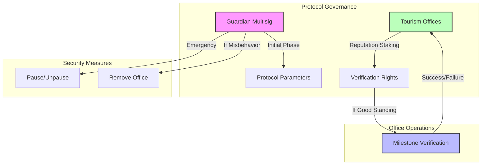

# **TurismoFund — Tourism Entrepreneurship Funding Protocol**

### ✨ Connecting international funding to local tourism projects through trusted offices

---

## **1. Executive Summary**

**TurismoFund** is a protocol that connects international funding to local
tourism entrepreneurship through a network of trusted tourism offices. Built on
the **BlockDAG Primordial Testnet** with **Safe{Core}** account abstraction and
**Safe{Wallet}** for multisig operations, we solve real problems in tourism
funding:

- 🌍 **Cross-Border Access**: International funding for local tourism projects
- 🔐 **Programmable Escrow**: Automated milestone-based fund releases
- 📊 **Verifiable Impact**: Transparent tracking of project progress
- 💰 **Reduced Costs**: Lower fees than traditional banking and escrow services

### How It Works

1. **Funding Flow**:
   ```mermaid
   graph LR
       A[International Investor] -->|BlockDAG Tokens| B[Smart Contract Escrow]
       B -->|Milestone Release| C[Tourism Office SafeWallet]
       C -->|Local Currency| D[Tourism Entrepreneur]
       D -->|Project Progress| E[Office Verification]
       E -->|Milestone Confirmation| B
   ```

2. **Milestone Verification**:
   ```mermaid
   graph LR
       A[Project Milestone] -->|Evidence| B[Tourism Office]
       B -->|Verification| C[Smart Contract]
       C -->|Release| D[Next Milestone Funds]
       D -->|Local Currency| E[Entrepreneur]
       E -->|Progress| F[Community Verification]
   ```

### Core Benefits

1. **For Tourism Entrepreneurs**:
   - Access to international funding
   - Reliable milestone-based releases
   - Lower transaction costs
   - Clear project tracking
   - Local support and guidance

2. **For International Investors**:
   - Transparent fund usage
   - Automated milestone releases
   - Verifiable project impact
   - Lower escrow costs
   - 24/7 funding availability

3. **For Tourism Offices**:
   - New revenue stream
   - Enhanced local services
   - Reputation building
   - Community trust
   - Network participation

### Why Blockchain?

1. **Programmable Escrow**:
   - Smart contracts automate milestone-based releases
   - No expensive third-party escrow services needed
   - Transparent conditions for fund release
   - Immutable record of milestone completion

2. **Global Liquidity Pool**:
   - International donors can contribute easily
   - No need for multiple currency conversions
   - Reduced forex fees
   - 24/7 funding availability

3. **Verifiable Impact**:
   - Transparent tracking of fund usage
   - Immutable record of project progress
   - Clear connection between funding and outcomes
   - Community verification of impact

### MVP Focus: Digital Tourism Office Simulation

During the **ETH Canal Hackathon**, we will develop a **functional MVP in one
week** demonstrating:

- 🔐 **Safe{Wallet} Setup**: 3-of-4 signature requirement for office operations
- 💸 **Payment Handling**: Support for cash, bank transfers, and crypto
- 📱 **Transaction Flow**: Complete on/off-ramp process with verifications

### Crystal-Clear MVP Scope

#### What's IN Scope for the Hackathon:

- ✅ **Single Tourism Office**: One (mock digital) office with Safe{Wallet}
  setup
- ✅ **Basic Escrow Contract**: Fixed amount escrow with guardian approval
- ✅ **Payment Methods**: Support for cash, bank transfers, and crypto
- ✅ **Simple Milestone Verification**: Guardian multisig approval
- ✅ **Minimal Dashboard**: Basic transaction recording
- ✅ **Digital Receipt System**: Simulated paper receipts + SMS confirmations

### MVP Implementation

1. **Day 1-2: Smart Contracts**
   - Basic escrow contract
   - Guardian multisig setup
   - Safe{Wallet} integration

2. **Day 3-4: Frontend Interface**
   - Milestone submission form
   - Payment method selection
   - Basic dashboard

3. **Day 5: Integration**
   - Connect contracts to frontend
   - Test payment flows
   - Verify milestone process

4. **Day 6-7: Testing & Documentation**
   - End-to-end testing
   - Documentation
   - Demo preparation

### Simplified MVP Flow

1. **Funding (On-Ramp)**:
   ```mermaid
   graph LR
       A[Investor] -->|BlockDAG Tokens| B[Escrow Contract]
       B -->|Hold| C[Fixed Amount]
       D[Guardian Multisig] -->|Verify| B
   ```

2. **Disbursement (Off-Ramp)**:
   ```mermaid
   graph LR
       A[Escrow Contract] -->|Release| B[SafeWallet]
       C[Milestone Evidence] -->|Submit| D[Guardian Multisig]
       D -->|Approve| A
       B -->|Choose| E[Payment Method]
       E -->|Cash| F[Local Cash]
       E -->|Bank Transfer| G[Bank Account]
       E -->|Crypto| H[Crypto Wallet]
   ```

### MVP Success Metrics

| Metric Category | Initial Target           | Measurement Method     |
| --------------- | ------------------------ | ---------------------- |
| Smart Contracts | Basic escrow working     | Contract testing       |
| Safe{Wallet}    | 3-of-4 signature working | Functional tests       |
| Payment Methods | All methods supported    | Transaction completion |
| User Experience | < 5 min transaction time | Time tracking          |
| Documentation   | Complete guide           | Staff feedback         |

### Hackathon MVP Deliverables

- ✅ **Smart Contracts**: Basic escrow and Safe{Wallet} integration
- ✅ **Office Dashboard**: Simple interface for milestone submission
- ✅ **Payment Handling**: Support for cash, bank transfers, and crypto
- ✅ **Documentation**: Basic operations guide for tourism office staff
- ✅ **Demo Video**: Complete end-to-end flow demonstration
- ✅ **Pitch Deck**: 10-slide presentation of the concept and MVP

### How Regular People Will Interact with TurismoFund (Post-MVP)

#### For Tourism Entrepreneurs:

1. **Visit Local Tourism Office**: Meet with staff in person
2. **Present Project**: Share your tourism initiative
3. **Set Milestones**: Define clear, verifiable project steps
4. **Receive Funds in Local Currency**: When milestones are completed
5. **Get Paper Receipt**: For all transactions
6. **Receive SMS Confirmations**: For added security

#### For International Investors:

1. **Browse Projects**: View available tourism initiatives
2. **Select Project**: Choose one to support
3. **Send Funds**: Transfer BlockDAG tokens to smart contract
4. **Track Progress**: Monitor milestone completion
5. **Verify Impact**: See project outcomes
6. **Support More**: Fund additional projects

#### For Tourism Office Staff:

1. **Verify Entrepreneurs**: KYC and project validation
2. **Use Simple Dashboard**: Record transactions
3. **Verify Milestones**: Through photos and community attestation
4. **Manage Safe{Wallet}**: Through guided interface
5. **Issue Receipts**: Paper + digital records
6. **Send SMS Confirmations**: To all parties

**Key Point**: All blockchain/crypto complexity is hidden behind familiar
interfaces. Users never need to:

- Create crypto wallets
- Handle private keys
- Understand blockchain technology
- Deal with gas fees
- Worry about crypto volatility

### Governance Structure

1. **Guardian Multisig (MVP Phase)**:
   - 3-5 trusted members
   - Controls essential protocol parameters
   - Emergency pause functionality
   - Office onboarding approval
   - Security oversight

2. **Tourism Office Network**:
   - Individual offices with Safe{Wallet} multisig
   - Reputation-based verification rights
   - Local milestone verification
   - Community engagement
   - Transparent operations

3. **Progressive Decentralization**:
   - Phase 1: Guardian-controlled with basic reputation system
   - Phase 2: Community-proposed updates with guardian oversight
   - Phase 3: Full community governance with minimal guardian intervention

### Governance Model



### Key Benefits

- **For Tourism Entrepreneurs**: Access to international funding with local
  support
- **For International Investors**: Transparent, verifiable impact
- **For Tourism Offices**: New revenue stream and community trust
- **For Protocol**: Progressive decentralization with security

---

## **2. Problem Statement**

Tourism entrepreneurship funding faces critical challenges:

1. **Cross-Border Funding Barriers**:
   - Traditional international transfers are slow and expensive
   - Tourism entrepreneurs often need access to international investors/donors
   - Currency exchange fees can be significant
   - Bank restrictions in developing regions limit access

2. **Trust and Transparency Issues**:
   - Donors want proof funds are used as intended
   - Entrepreneurs need reliable milestone-based releases
   - Traditional escrow services are expensive
   - Tracking fund usage across borders is difficult

3. **Local Implementation Challenges**:
   - Lack of trusted intermediaries
   - Limited access to international funding
   - High transaction costs
   - Complex verification processes

The solution must address all three:

- Accessible funding for tourism entrepreneurs
- Transparent fund usage for investors
- Trusted local implementation

---

## **3. The TurismoFund Solution**

TurismoFund creates a network of trusted tourism offices that serve as secure
bridges between international funding and local tourism projects:

### Local Office Operations

1. **Project Verification Process**:
   ```mermaid
   graph TD
       A[Initial Contact] -->|Visit| B[ID Verification]
       B -->|Validate| C[Project Assessment]
       C -->|Define| D[Milestone Creation]
       D -->|Record| E[Smart Contract]
       E -->|Funds| F[Investor Contribution]
       F -->|Hold| G[Escrow Contract]
   ```

2. **Milestone Verification Process**:
   ```mermaid
   graph TD
       A[Milestone Completion] -->|Evidence| B[Office Verification]
       B -->|Approve| C[Smart Contract]
       C -->|Release| D[Next Milestone Funds]
       D -->|Convert| E[Local Currency]
       E -->|Deliver| F[Entrepreneur]
       F -->|Progress| G[Next Milestone]
   ```

3. **Security Features**:
   - Safe{Wallet} multisig (3-of-4)
   - Daily transaction limits
   - Multi-party verification
   - Paper + digital records
   - Real-time notifications
   - Regular audits

### Protocol Governance

1. **Guardian Multisig (MVP)**:
   - Controls essential parameters
   - Emergency pause functionality
   - Office onboarding approval
   - Security oversight

2. **Office Reputation System**:
   - Performance tracking
   - Verification accuracy
   - Community feedback
   - Time in network
   - Project success rate

3. **Progressive Decentralization**:
   - Phase 1: Guardian-controlled
   - Phase 2: Community-proposed updates
   - Phase 3: Full community governance

---

## **4. Core Features**

### 🔐 Office Safe{Wallet} Multisig

1. **Signer Structure**:
   - Office Director
   - Financial Officer
   - Community Representative
   - Technical Operator
   - 3-of-4 signature requirement

2. **Transaction Controls**:
   - Daily transaction limits
   - Withdrawal thresholds
   - Emergency pause
   - Audit logging

3. **Operational Standards**:
   - Project verification procedures
   - Milestone validation
   - Receipt management
   - Security protocols

### 💰 Fund Management

1. **Smart Contract Escrow**:
   - Milestone-based releases
   - Automated fund distribution
   - Transparent conditions
   - Immutable records

2. **Local Currency Conversion**:
   - Tourism office handles conversion
   - Fixed exchange rates for periods
   - Transparent fee structure
   - Regular reconciliation

3. **Verification Process**:
   - Multi-party checks
   - Photo documentation
   - Community attestation
   - Blockchain records
   - Receipt confirmation

### 📱 Partner Interface

- Web dashboard features:
  - Project tracking
  - Milestone verification
  - Fund management
  - Basic reporting

---

## **5. MVP Success Metrics**

| Metric Category        | Initial Target           | Measurement Method     |
| ---------------------- | ------------------------ | ---------------------- |
| Safe{Wallet} Setup     | 3-of-4 signature working | Functional tests       |
| Milestone Verification | Complete flow tested     | Transaction completion |
| Smart Contract Escrow  | Fund release working     | Contract testing       |
| User Experience        | < 5 min verification     | Time tracking          |
| Documentation          | Complete guide           | Staff feedback         |

### MVP Infrastructure

1. **Protocol Systems**:
   - Basic escrow contracts
   - Safe{Wallet} multisig management
   - Guardian multisig setup
   - Upgrade mechanisms

2. **Local Systems**:
   - Project tracking ledger
   - Milestone verification system
   - Basic web dashboard
   - SMS notifications
   - Receipt generation

### Hackathon MVP Deliverables

- ✅ **Smart Contracts**: Basic escrow and multisig operations
- ✅ **Office Dashboard**: Simple interface for project tracking
- ✅ **Milestone Verification**: Digital representation of project progress
- ✅ **Documentation**: Basic operations guide for tourism office staff
- ✅ **Demo Video**: Complete end-to-end flow demonstration
- ✅ **Pitch Deck**: 10-slide presentation of the concept and MVP
