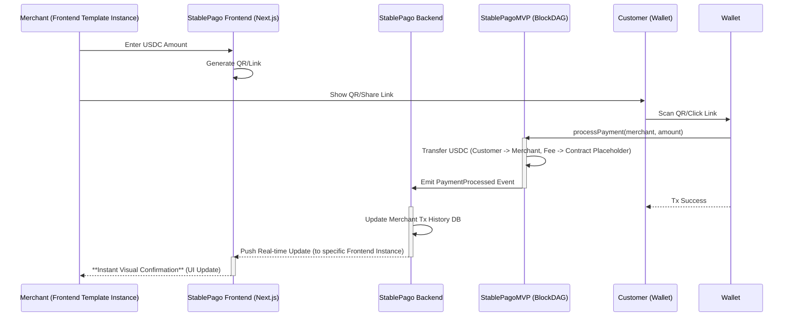

# 🌎 **StablePago Protocol: Community-Enabled Payments for Panama & Beyond**

## 1. Executive Summary

Payment fragmentation plagues local economies like Panama's tourism sector.
**StablePago Protocol** offers the core, flexible infrastructure: a mobile-first
USDC POS app with a low 1.8% fee and instant settlement via BlockDAG. Our
hackathon MVP delivers this _and_ the foundation for an **Open-Source Community
Frontend Template**, enabling communities like **TuriStable DAO** (focused on
Panama tourism) to easily launch tailored interfaces and govern their share of
protocol revenue, fostering sustainable, locally-driven growth.

---

## 2. The Problem: Fragmented Payments & Stifled Growth

Local SMEs, particularly in tourism-heavy, dollarized economies like Panama,
struggle with:

- **Exorbitant Card Fees:** International cards charge 5-7%, slashing crucial
  margins.
- **Delayed Funds:** Multi-day settlement cycles disrupt essential cash flow.
- **Bookkeeping Nightmares:** Reconciling disparate payment streams (cash,
  cards, apps) is manual, time-consuming, and error-prone.
- **Financial Exclusion:** Fragmented, non-verifiable data hinders access to
  micro-loans and growth capital.

This operational friction prevents SMEs from optimizing finances, reinvesting
locally, and building economic resilience.

---

## 3. The Solution: StablePago Protocol MVP, Community Enablement, TuriStable DAO Vision

**StablePago Protocol** provides the foundational infrastructure, designed for
efficiency, security, and crucially, community enablement. **TuriStable DAO** is
the _first example_ of a community leveraging this infrastructure.

**MVP: StablePago Protocol - The Mobile USDC POS Engine & Template Foundation**

Our hackathon project delivers the core **StablePago Protocol** engine via a
**standalone, mobile-first web application** for instant **USD Coin (USDC)**
acceptance. This app serves a dual purpose:

1. **Immediate Value:** Provides Panama SMEs with an immediate tool for low-fee,
   instant USDC payments.
2. **Template Foundation:** Acts as the Version 1.0 and basis for an
   **Open-Source Community Frontend Template**.

**Key Protocol Features:**

- **Effortless USDC:** Generate QR codes/links via smartphone/tablet.
- **Transparent 1.8% Fee:** Designed for SME affordability.
- **Instant Settlement:** BlockDAG speeds provide near-immediate fund access.
- **Verifiable History:** On-chain, exportable transaction records.
- **Built on Trust:** Uses regulated, dollar-backed USDC.

**Community Enablement via Open Infrastructure & Templates:**

StablePago Protocol is _not_ a monolithic "DAO of DAOs." It's an open, flexible
payment rail. Any verified community (tourism boards, artisan guilds, local
markets) can:

1. **Leverage the Protocol:** Utilize the core payment infrastructure.
2. **Fork the Template:** Adapt the open-source frontend template for their
   specific branding and needs.
3. **Form their DAO:** Establish their own governance structure (e.g.,
   **TuriStable DAO**) to manage their allocated share of protocol fees (see
   Governance Model).

**Vision: TuriStable DAO - A Blueprint for Local Governance**

The **TuriStable DAO** serves as the pilot community. Funded by the fee share
from participating Panamanian tourism SMEs, this independent DAO will govern its
treasury, allocating funds to local tourism development, demonstrating the power
of community-specific governance built _on top of_ StablePago.

---

## 4. Hero Feature Spotlight: Instant Visual Confirmation

The **standout StablePago MVP capability** is the **instant, real-time visual
confirmation** of USDC payments in the merchant's app (the template foundation).
Our backend (Convex) detects BlockDAG confirmation (~2-5s) and immediately
updates the UI.

This provides **undeniable proof-of-payment**, builds trust, highlights BlockDAG
efficiency, and validates the core real-time data infrastructure necessary for
all frontends built using the template.

---

## 5. MVP Scope & 5-Day Plan (Core Protocol + Template Foundation)

Focus is strictly on the **StablePago Protocol payment engine** and the
**foundational frontend app/template**:

- **Core Functionality:**
  - Merchant registration/login (Convex auth).
  - **Mobile-first web app (Next.js) serving as V1.0 template:** generating USDC
    payment QR/links.
  - Minimal, secure BlockDAG Smart Contract (`StablePagoMVP`) for USDC transfer
    & 1.8% fee collection/split placeholders (ERC20, ReentrancyGuard,
    Checks-Effects-Interactions).
  - Convex backend listening for `PaymentProcessed` events → **real-time DB
    updates**.
  - App dashboard: transaction history **with instant visual confirmation**.
  - CSV export of USDC transaction history.
  - **Indicative** USD/PAB price display (via centralized API like CoinGecko).
- **Exclusions:** Actual fee-splitting contract logic, full TuriStable DAO (or
  any DAO) governance contracts, complex off-ramping, unified dashboard
  integrations.

**5-Day Plan:**

1. **Day 1 (Foundation):** Setup Turborepo (Next.js, Convex, Foundry). Define
   `StablePagoMVP` interface & data models. Design template structure.
2. **Day 2 (Contract):** Implement & test secure `StablePagoMVP` contract
   (transfer, fee placeholder, event).
3. **Day 3 (Backend):** Deploy contract. Setup Convex (auth, event listener,
   **real-time DB updates**).
4. **Day 4 (Frontend Template V1):** Build core POS UI/UX (QR/link), Tx History
   display (**instant update**, indicative fiat).
5. **Day 5 (E2E & Polish):** Connect wallet, test full payment flow -> **instant
   confirmation**, refine template styling, deploy, prep demo.

---

## 6. Architecture Overview (StablePago Protocol Core)

The architecture focuses on the reusable backend and core contract
infrastructure. The frontend shown is an _instance_ derived from the community
template.

- **Frontend (Template Instance):** Mobile-first Next.js web application
  (forkable/customizable).
- **Backend:** Convex (real-time DB, auth, serverless functions for event
  listening).
- **Blockchain:** EVM-compatible BlockDAG hosting `StablePagoMVP` contract.

---

## 7. Governance & Sustainability Model

StablePago Protocol ensures long-term viability and aligns incentives via a
planned on-chain fee split of the 1.8% transaction fee:

- **0.6% → Protocol Treasury:** Funds core infrastructure (servers, nodes),
  security audits, operational overhead, and potentially gas subsidies. Ensures
  protocol reliability and security.
- **0.6% → Community DAO Treasuries (e.g., TuriStable DAO):** Automatically
  routed to the designated treasury of the DAO governing the specific community
  using the protocol. Empowers local, autonomous funding decisions.
- **0.6% → Protocol Maintainers/Stakers:** Rewards core developers,
  contributors, and potentially stakers who secure/support the network, ensuring
  ongoing innovation.

**Economic Viability:** This balanced split provides dedicated revenue streams
to cover operational costs, directly fund community initiatives based on usage,
and incentivize continuous development and maintenance, creating a sustainable
positive feedback loop.

**Game Theory & Fair Governance (Future State):** To ensure long-term health and
prevent capture at _both_ the protocol maintenance level and within community
DAOs, future iterations can incorporate mechanisms like: - **Quadratic
Voting/Funding:** Prevents disproportionate influence by large token holders. -
**Reputation/Usage Weighting:** Grants influence based on active participation,
transaction history, or verified contributions, rewarding "skin-in-the-game." -
**Identity Solutions:** Links votes/participation to unique entities (SMEs,
individuals) to resist Sybil attacks. _The specific mechanisms would be chosen
and implemented by the protocol maintainers (for their share) and independently
by each community DAO (for their share)._

---

## 8. Competitive Landscape

StablePago Protocol differentiates itself in the growing stablecoin payment
space:

- Compared to generic crypto POS systems or potential **Lemon Squeezy** crypto
  features, StablePago offers a **fundamentally open infrastructure** combined
  with a **built-in, transparent fee-split mechanism** designed explicitly to
  **empower community DAOs**.
- The provision of an **Open-Source Frontend Template** drastically lowers the
  barrier for communities to adopt and customize the system, fostering
  grassroots adoption in a way closed platforms cannot. This focus on
  composability and community ownership is unique.

---

## 9. Key Metrics & Savings

Clear advantages for SMEs:

- **Fee Savings:**
  - Typical Int'l Card Fee: ~5.0%
  - StablePago Protocol Fee: **1.8%**
  - **Saving:** **$3.20** per $100 USDC transaction.
- **Speed (BlockDAG Estimates):**
  - Transaction Finality: **~2-5 seconds**.
  - Gas Cost: **~0.0005 USDC** (estimate).
- **Settlement:** Near-instant access to funds.

---

## 10. User Experience (StablePago MVP / Template V1.0)

Focus on simplicity for the initial template:

- **Mobile POS Flow:**
  1. Log In (Merchant).
  2. Enter amount **in USDC** (Indicative PAB/USD shown).
  3. Generate QR/Link.
  4. Present to Tourist.
  5. **See Instant Visual Confirmation**.
- **Indicative Fiat Display:** Fetches approximate USD/PAB price (e.g., via
  CoinGecko API), clearly labeled **indicative**.
- **Simple History:** View/export USDC transaction CSV.

 _(Placeholder for App UI /
Template V1.0)_ 
_(Placeholder for Dashboard UI / Template V1.0)_

---

## 11. Local Community Impact (Enabled by StablePago)

The protocol acts as a catalyst for local economic empowerment:

- **Boosts SME Revenue:** Direct fee savings increase reinvestment capacity.
- **Funds Local Initiatives:** The 0.6% community fee share provides autonomous
  funding for DAOs like **TuriStable DAO** to address specific local needs
  (marketing, training, infrastructure).
- **Improves Financial Access:** Verifiable data aids loan applications.
- **Modernizes Payments:** Offers tourists a trusted, low-fee digital option.

**Micro-Case Study (Illustrative):**

- _A Panamanian artisan guild forks the **StablePago Frontend Template**, brands
  it, and forms its own DAO. The 0.6% fee share collected from guild members'
  sales funds raw material purchases and participation in international craft
  fairs, decisions made collectively via their DAO._

---

## 12. Future Roadmap

The MVP validates the core engine and provides the foundational template. Next
steps:

1. **Refine & Release Frontend Template:** Open-source the V1.0 frontend app as
   a customizable template with clear documentation.
2. **Implement Fee Splitting:** Deploy smart contract logic for the 3-way fee
   split.
3. **Develop DAO Tooling:** Create resources/guides for communities to launch
   DAOs utilizing the StablePago infrastructure and fee share.
4. **TuriStable DAO Formalization (Pilot):** Launch the initial governance
   contracts for the TuriStable DAO pilot.
5. **Explore Integrations:** Investigate APIs (e.g., **Lemon Squeezy**) for
   unified dashboard capabilities.
6. **Partner for Off-Ramping:** Facilitate easy USDC-to-fiat conversion routes.

---

**(Note: Detailed smart contract code (`StablePagoMVP.sol`), security patterns,
and setup instructions are in the technical appendix/codebase.)**
