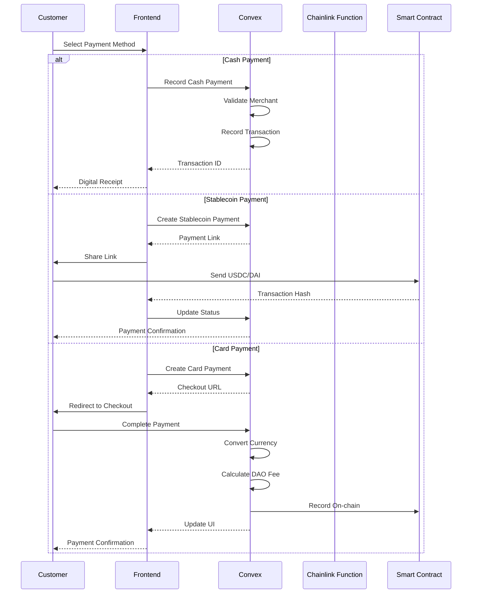
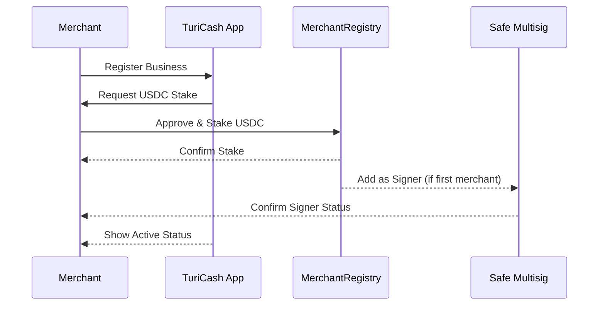
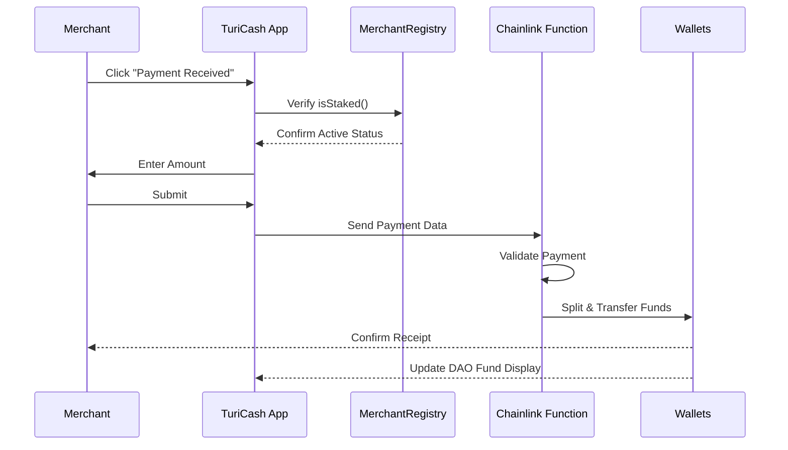
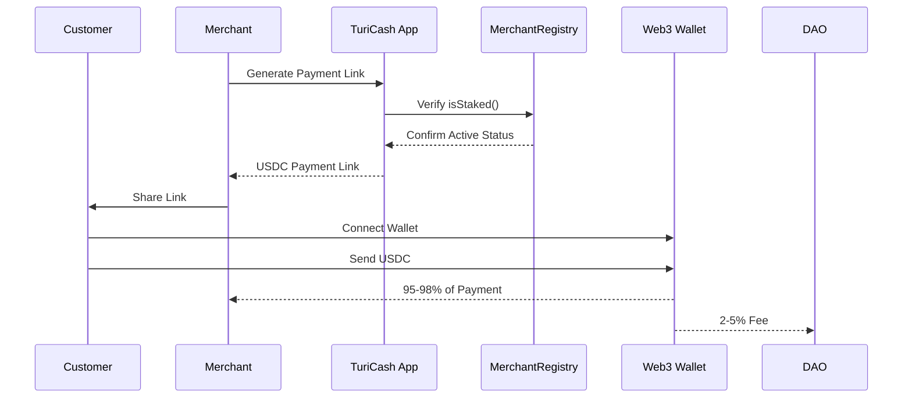
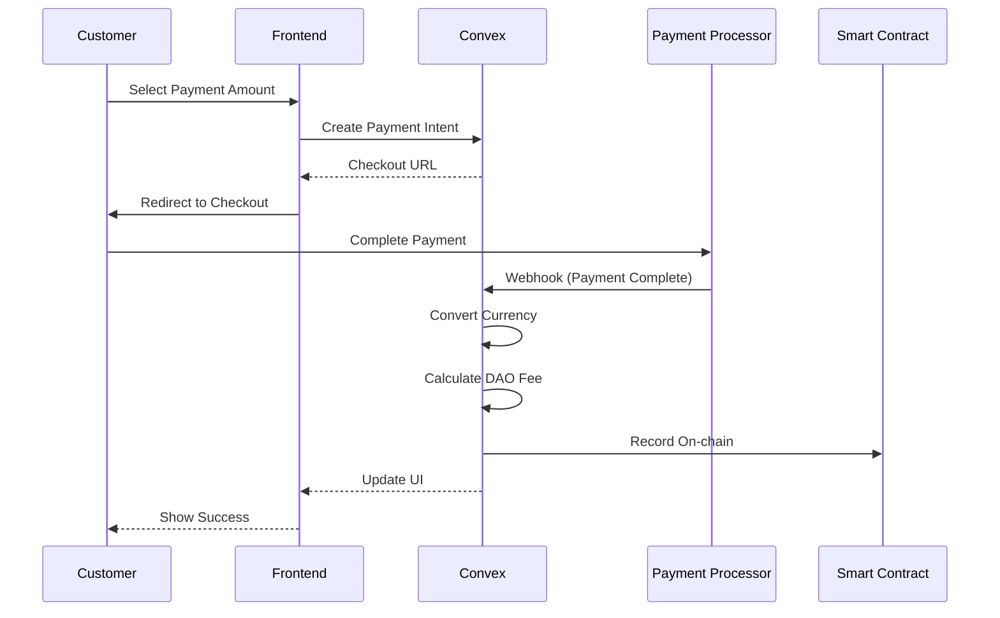
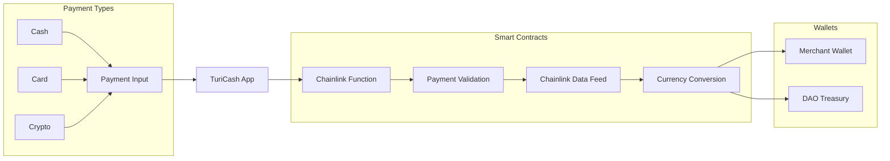
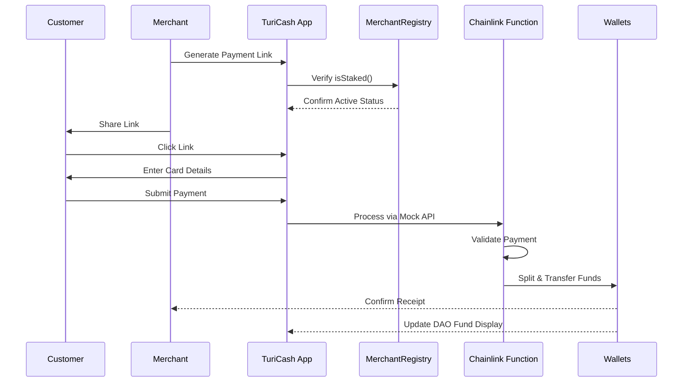
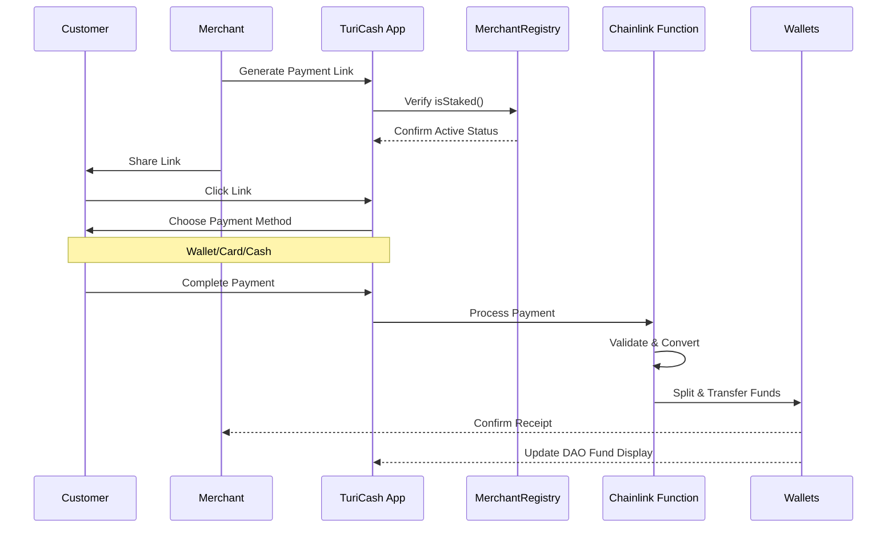

# 🌎 **TuriCash DAO: Empowering Local Tourism Communities**

## 📌 Summary

**TuriCash DAO** is a revolutionary payment platform designed specifically for
tourism communities in emerging markets. We transform how local tourism
businesses handle payments by:

1. **Unlock Global Revenue Streams:** Seamlessly accept credit card and
   stablecoin payments from international tourists, capturing bookings and sales
   previously lost due to payment friction. Bypass costly traditional
   intermediary fees and expand your customer base globally.

2. **Build Verifiable Business Credit:** Transform untrackable cash flow into a
   digital financial history, unlocking access to significantly larger business
   loans, partnerships, and investment opportunities essential for expansion.
   Your business growth is no longer limited by cash-only operations.

3. **Gain Governance Power:** Secure not just payment tools, but a voice in
   directing community funds towards local infrastructure improvements that
   directly benefit your business operations and attractiveness to tourists.
   Your stake gives you influence over tourism development.

By focusing exclusively on tourism communities, we deliver tailored solutions
that address their unique challenges while fostering sustainable growth. Your
10,000 USDC stake is an investment in your business's future, unlocking services
worth far more than traditional alternatives.

---

## 🎯 Why Tourism Communities Need TuriCash

### 1. The Tourism Payment Challenge

Local tourism businesses face a critical disconnect: while they serve
international tourists, they struggle to receive payments globally. This
affects:

- **Tour Guides:** Lose 40-60% of potential bookings due to inability to accept
  advance payments or digital tips. Traditional payment processors charge 5-7%
  per transaction, eating into your margins.
- **Local Artisans:** Miss 70% of sales from tourists who prefer digital
  payments. Without global payment acceptance, you're limited to cash-only local
  markets.
- **Small Hotels:** Lose 30-50% of bookings due to complex international payment
  requirements. Traditional banks require hefty deposits and charge high fees
  for international transactions.
- **Tourism Services:** Struggle with seasonal cash flow management, unable to
  secure loans or investment due to lack of verifiable income history.

### 2. The Cash Management Problem

Tourism businesses operate in a cash-heavy environment, but this creates
significant challenges:

- **Lost Opportunities:** No digital records mean no access to business loans.
  Traditional lenders require 2-3 years of bank statements, which cash-only
  businesses can't provide.
- **Limited Growth:** Can't prove income for expansion or partnerships. Without
  verifiable financial history, you miss out on:
  - Business loans (typically 2-3x your annual revenue)
  - Partnership opportunities with larger tourism operators
  - Investment from tourism-focused venture funds
- **Operational Inefficiency:** Manual cash tracking consumes 5-10 hours per
  week of valuable time that could be spent on business development.
- **Market Visibility:** Stay invisible to digital tourism platforms that
  require integrated payment solutions.

---

## 💡 The TuriCash Solution

### 🔁 Tourism-First Payment Processing

1. **Smart Cash Recording**
   - Instant QR-based cash payment recording with digital receipts
   - Automated daily/weekly/monthly financial reporting
   - Proof of income for business growth and loans
   - Tourism-specific analytics and insights
   - Integration with major booking platforms

2. **Global Payment Acceptance**
   - Accept payments from tourists worldwide with 1-2% lower fees than
     traditional processors
   - Support for all major credit cards, digital wallets, and stablecoins
   - No local bank account needed - receive funds directly to your wallet
   - Tourism-friendly currency conversion with best rates
   - Automated reconciliation and reporting

#### 🧠 Community-Driven Development

- 3% of each transaction builds the community fund
- Direct input on infrastructure improvements:
  - Tourism signage and information centers
  - Local WiFi and digital infrastructure
  - Training programs for tourism businesses
  - Marketing campaigns for your region
- Sustainable funding model that grows with your business
- Transparent fund allocation and impact tracking

#### 🔒 Trust & Security (MVP Phase)

_Note: The following mechanisms are simplified for the MVP phase. A more robust
trust system including staking will be implemented in production._

- Tourism-focused merchant verification
- Transaction monitoring with tourism patterns
- Community-based trust system
- Future plans:
  - Reputation system for tourism businesses
  - Automated fraud detection
  - Tiered access based on tourism history

---

## 🔗 Web3 Architecture

### ✅ **Chainlink Functions**

Chainlink Functions will:

1. Receive data from QR code scans (simulated in MVP)
2. Verify reported payment amounts against pre-defined limits (e.g., max
   transaction size)
3. Calculate DAO contribution (e.g., 3% of payment)
4. Trigger fund transfers to merchant's wallet and DAO's multisig wallet using
   Chainlink Automation

Data Sources:

- Internal API for payment validation
- External APIs for tourism data verification
- Chainlink's decentralized oracle network for secure data processing

### 📊 **Chainlink Data Feeds**

- Provide exchange rates for USD/USDC and USD/DAI pairs
- Ensure fair conversion in the multi-currency system
- Guarantee real-time prices for reports and records

Security Considerations:

- Chainlink's decentralized nature prevents price data manipulation
- Multi-source data validation ensures reliability
- Automated security checks for transaction limits and patterns

Future Integration:

- Chainlink Automation for automated fund distribution
- Scheduled payments based on community votes
- Automated treasury management

---

## 📦 MVP in 1 Week

**MVP Scope (April 2025):**

1. **Cash Recording System**
   - QR code generation for cash payments
   - Simple form to record cash received
   - Digital receipt generation
   - Basic transaction history
   - Daily/weekly reporting

2. **Digital Payment Gateway**
   - Stablecoin payments (USDC, DAI)
   - Payment link generation
   - Multiple currency support
   - Automatic currency conversion
   - Payment status tracking

3. **Core Infrastructure**
   - Basic merchant verification
   - Transaction monitoring
   - Simple multisig for community fund
   - Convex backend for Web2 operations

4. **Public Dashboard**
   - Transaction history by type
   - Payment status tracking
   - Basic analytics
   - Community fund balance

### Web2 API Integration (Convex)

#### 1. Types and Interfaces

```typescript
// types.ts
interface MerchantProfile {
  walletAddress: string;
  businessName: string;
  businessType: string;
  location: string;
  kycStatus: "pending" | "approved" | "rejected";
  dailyLimits: {
    cashReporting: number; // USD
    digitalPayments: number; // USD
  };
  createdAt: number;
  updatedAt: number;
}

interface Transaction {
  id: string;
  merchantAddress: string;
  amount: number;
  originalAmount?: number;
  originalCurrency?: string;
  type: "cash" | "stablecoin" | "card";
  status: "completed" | "failed";
  daoFee: number;
  processorTransactionId?: string;
  createdAt: number;
}

interface PaymentIntent {
  id: string;
  merchantAddress: string;
  amount: number;
  currency: string; // USDC, DAI, USD, EUR, etc.
  type: "stablecoin" | "card";
  status: "pending" | "completed" | "failed";
  customerCountry?: string;
  processorTransactionId?: string;
  createdAt: number;
  completedAt?: number;
}
```

#### 2. Merchant Management

```typescript
// merchants.ts
export const registerMerchant = mutation({
  args: {
    walletAddress: v.string(),
    businessName: v.string(),
    businessType: v.string(),
    location: v.string(),
  },
  handler: async (ctx, args) => {
    // Simulate KYC verification
    const kycStatus = "approved";

    return await ctx.db.insert("merchants", {
      ...args,
      kycStatus,
      dailyLimits: {
        cashReporting: 10000, // $10,000 USD daily limit for cash
        digitalPayments: 50000, // $50,000 USD daily limit for digital
      },
      createdAt: Date.now(),
      updatedAt: Date.now(),
    });
  },
});

export const getMerchantProfile = query({
  args: { walletAddress: v.string() },
  handler: async (ctx, args) => {
    return await ctx.db
      .query("merchants")
      .filter((q) => q.eq(q.field("walletAddress"), args.walletAddress))
      .first();
  },
});

export const updateMerchantProfile = mutation({
  args: {
    walletAddress: v.string(),
    updates: v.object({
      businessName: v.optional(v.string()),
      businessType: v.optional(v.string()),
      location: v.optional(v.string()),
    }),
  },
  handler: async (ctx, args) => {
    const merchant = await ctx.db
      .query("merchants")
      .filter((q) => q.eq(q.field("walletAddress"), args.walletAddress))
      .first();

    return await ctx.db.patch(merchant._id, {
      ...args.updates,
      updatedAt: Date.now(),
    });
  },
});
```

#### 3. Payment Processing

```typescript
// payments.ts
// Cash Recording
export const recordCashPayment = mutation({
  args: {
    merchantAddress: v.string(),
    amount: v.number(),
    location: v.string(),
    description: v.optional(v.string()),
  },
  handler: async (ctx, args) => {
    await validateMerchantAndLimits(
      ctx,
      args.merchantAddress,
      args.amount,
      "cash",
    );
    const daoFee = calculateDaoFee(args.amount);

    return await createTransaction(ctx, {
      ...args,
      type: "cash",
      status: "completed",
      daoFee,
    });
  },
});

// Stablecoin Payments
export const createStablecoinPayment = mutation({
  args: {
    merchantAddress: v.string(),
    amount: v.number(),
    currency: v.string(), // USDC or DAI
    description: v.optional(v.string()),
  },
  handler: async (ctx, args) => {
    await validateMerchantAndLimits(
      ctx,
      args.merchantAddress,
      args.amount,
      "stablecoin",
    );

    const paymentId = generateId();
    await ctx.db.insert("paymentIntents", {
      id: paymentId,
      ...args,
      type: "stablecoin",
      status: "pending",
      createdAt: Date.now(),
    });

    return { paymentId };
  },
});

// Card Payments
export const createCardPayment = mutation({
  args: {
    merchantAddress: v.string(),
    amount: v.number(),
    currency: v.string(),
    customerCountry: v.string(),
    description: v.optional(v.string()),
  },
  handler: async (ctx, args) => {
    const usdAmount = await convertToUSD(args.amount, args.currency);
    await validateMerchantAndLimits(
      ctx,
      args.merchantAddress,
      usdAmount,
      "card",
    );

    const paymentId = generateId();
    await ctx.db.insert("paymentIntents", {
      id: paymentId,
      ...args,
      type: "card",
      status: "pending",
      createdAt: Date.now(),
    });

    return {
      paymentId,
      checkoutUrl: `${CHECKOUT_URL}/${paymentId}`,
    };
  },
});
```

### Web2/Web3 Integration Flow



### Mock APIs for MVP

1. **Payment Validation API**
   ```json
   POST /api/payments/validate
   {
     "merchant_address": string,
     "amount": number,
     "type": "cash_report" | "usdc_payment",
     "location": string
   }
   Response:
   {
     "transaction_id": string,
     "status": "pending" | "validated" | "rejected",
     "reason": string
   }
   ```

2. **USDC Payment Processing**
   ```json
   POST /api/payments/process
   {
     "merchant_address": string,
     "amount": number,
     "payment_id": string
   }
   Response:
   {
     "transaction_id": string,
     "blockchain_tx": string,
     "status": "completed"
   }
   ```

3. **International Fiat Payment APIs**
   ```json
   POST /api/payments/fiat/create
   {
     "merchant_address": string,
     "amount": number,
     "currency": string,
     "customer_country": string
   }
   Response:
   {
     "payment_id": string,
     "checkout_url": string
   }
   ```

   ```json
   POST /api/payments/fiat/webhook
   {
     "payment_id": string,
     "processor_transaction_id": string,
     "status": "completed" | "failed",
     "processor_fee": number
   }
   Response:
   {
     "transaction_id": string,
     "status": "completed"
   }
   ```

### User Experience Flows

#### Merchant Onboarding Flow



#### Cash Recording Flow



#### USDC Payment Flow



#### International Fiat Payment Flow



## 🔧 Implementation Details

## 🛠 Development Roadmap

### Phase 1: Core Infrastructure (Week 1)

1. **Smart Contract Development**
   - Deploy `MerchantRegistry` contract
   - Implement staking mechanism
   - Set up Safe Multisig
   - Basic access control

2. **Backend Foundation**
   - Set up Convex project
   - Implement basic data models
   - Create merchant management APIs
   - Set up development environment

3. **Basic Frontend**
   - Merchant dashboard structure
   - Wallet connection
   - Basic transaction recording
   - Stake management interface

### Phase 2: Payment Processing (Week 2)

1. **Cash Recording System**
   - QR code generation
   - Transaction recording
   - Basic verification
   - Receipt generation

2. **Stablecoin Integration**
   - USDC/DAI payment processing
   - Payment link generation
   - Transaction monitoring
   - Settlement logic

3. **Card Payment Integration**
   - Payment processor setup
   - Checkout flow
   - Webhook handling
   - Settlement processing

### Phase 3: Financial Management (Week 3)

1. **Unified Dashboard**
   - Balance tracking
   - Transaction history
   - Analytics
   - Reporting

2. **Settlement System**
   - Automated settlements
   - Fee calculation
   - Batch processing
   - Multi-currency support

3. **Integration Testing**
   - End-to-end flows
   - Performance testing
   - Security testing
   - User acceptance testing

## 🔧 Technical Setup

### Prerequisites

```bash
# Required tools
node >= 18.0.0
pnpm >= 8.0.0
docker >= 20.10.0
```

### Environment Setup

```bash
# Clone repository
git clone https://github.com/your-org/turicash-dao.git
cd turicash-dao

# Install dependencies
pnpm install

# Set up environment variables
cp .env.example .env
```

### Required Services & API Keys

1. **Blockchain**
   - Ethereum node (Infura/Alchemy)
   - Chainlink Functions subscription
   - Chainlink Data Feeds

2. **Payment Processing**
   - Stripe/Checkout.com account
   - Payment processor API keys
   - Webhook endpoints

3. **Backend Services**
   - Convex project
   - Database setup
   - Storage solution

### Local Development

```bash
# Start local blockchain
pnpm hardhat node

# Deploy contracts
pnpm hardhat deploy --network localhost

# Start backend
pnpm convex dev

# Start frontend
pnpm dev
```

### Project Structure (Turborepo)

```bash
turicash-dao/
├── apps/
│   ├── web/                 # Next.js frontend
│   └── api/                 # Convex backend
├── packages/
│   ├── contracts/           # Solidity smart contracts
│   ├── shared/              # Shared utilities and types
│   └── ui/                  # Shared UI components
├── turbo.json               # Turborepo configuration
└── pnpm-workspace.yaml      # PNPM workspace configuration
```

### Turborepo Configuration

```json
// turbo.json
{
  "$schema": "https://turbo.build/schema.json",
  "globalDependencies": ["**/.env.*local"],
  "pipeline": {
    "build": {
      "dependsOn": ["^build"],
      "outputs": [".next/**", "!.next/cache/**", "dist/**"]
    },
    "lint": {},
    "dev": {
      "cache": false,
      "persistent": true
    },
    "test": {
      "dependsOn": ["build"],
      "outputs": ["coverage/**"],
      "inputs": ["src/**/*.tsx", "src/**/*.ts", "test/**/*.ts", "test/**/*.tsx"]
    }
  }
}
```

### PNPM Workspace Configuration

```yaml
# pnpm-workspace.yaml
packages:
  - "apps/*"
  - "packages/*"
```

## 🛠 Stack Configuration

### Arbitrum Configuration

```toml
# foundry.toml
[rpc_endpoints]
arbitrum_one = "${ARBITRUM_RPC_URL}"
arbitrum_sepolia = "${ARBITRUM_SEPOLIA_RPC_URL}"

[etherscan]
arbitrum_one = { key = "${ARBISCAN_API_KEY}" }
arbitrum_sepolia = { key = "${ARBISCAN_API_KEY}" }

# Gas optimization for L2
[profile.default]
gas_reports = ["*"]
gas_reports_ignore = []
solc = "0.8.20"
optimizer = true
optimizer_runs = 200
```

### Chainlink Setup

```typescript
// chainlink.config.ts
export const CHAINLINK_CONFIG = {
  // Functions
  functions: {
    subscriptionId: process.env.CHAINLINK_SUBSCRIPTION_ID,
    callbackGasLimit: 300000,
    requestConfirmations: 3,
    gasLimit: 2500000,
  },

  // Data Feeds (Arbitrum)
  priceFeeds: {
    USDC_USD: "0x50834F3163754fcAd1f7A4bE6F7f5C7c4A5c4c4c4", // Example address
    DAI_USD: "0x50834F3163754fcAd1f7A4bE6F7f5C7c4A5c4c4c4", // Example address
  },

  // Oracle Network
  oracle: {
    network: "arbitrum_one",
    minConfirmations: 3,
    maxDelay: 3600, // 1 hour
  },
};

// Example Functions request format
export const PAYMENT_VALIDATION_REQUEST = {
  source: fs.readFileSync("./functions/PaymentValidation.js").toString(),
  args: ["${merchantAddress}", "${amount}", "${paymentType}"],
  secrets: {
    API_KEY: process.env.PAYMENT_API_KEY,
  },
};
```

### Next.js + Convex Integration

```typescript
// convex/schema.ts
import { defineSchema, defineTable } from "convex/server";
import { v } from "convex/values";

export default defineSchema({
  merchants: defineTable({
    walletAddress: v.string(),
    businessName: v.string(),
    businessType: v.string(),
    location: v.string(),
    kycStatus: v.string(),
    dailyLimits: v.object({
      cashReporting: v.number(),
      digitalPayments: v.number(),
    }),
    createdAt: v.number(),
    updatedAt: v.number(),
  }),

  transactions: defineTable({
    id: v.string(),
    merchantAddress: v.string(),
    amount: v.number(),
    originalAmount: v.optional(v.number()),
    originalCurrency: v.optional(v.string()),
    type: v.string(),
    status: v.string(),
    daoFee: v.number(),
    processorTransactionId: v.optional(v.string()),
    createdAt: v.number(),
  }),
});

// Next.js API Routes
// pages/api/merchants/[address].ts
import { ConvexHttpClient } from "convex/browser";
import { api } from "../../../convex/_generated/api";

export default async function handler(req, res) {
  const client = new ConvexHttpClient(process.env.NEXT_PUBLIC_CONVEX_URL);

  if (req.method === "GET") {
    const merchant = await client.query(api.merchants.get, {
      address: req.query.address,
    });
    res.status(200).json(merchant);
  }
}

// Real-time Subscriptions
// hooks/useMerchantData.ts
import { useQuery } from "convex/react";
import { api } from "../convex/_generated/api";

export function useMerchantData(address: string) {
  return useQuery(api.merchants.get, { address });
}
```

### Environment Variables

```bash
# .env
# Blockchain
ARBITRUM_RPC_URL=https://arb1.arbitrum.io/rpc
ARBITRUM_SEPOLIA_RPC_URL=https://sepolia-rollup.arbitrum.io/rpc
ARBISCAN_API_KEY=your_api_key

# Chainlink
CHAINLINK_SUBSCRIPTION_ID=your_subscription_id
CHAINLINK_API_KEY=your_api_key

# Convex
NEXT_PUBLIC_CONVEX_URL=your_convex_url
CONVEX_DEPLOY_KEY=your_deploy_key

# Payment Processing
STRIPE_SECRET_KEY=your_stripe_key
STRIPE_WEBHOOK_SECRET=your_webhook_secret
```

## 🔒 Security Specifications

### Smart Contract Security

1. **Access Control**
   - Role-based permissions
   - Multi-signature requirements
   - Time-locks for critical operations
   - Emergency pause functionality

2. **Fund Safety**
   - Withdrawal limits
   - Cooldown periods
   - Slashing conditions
   - Fee caps

3. **Data Validation**
   - Input sanitization
   - Range checks
   - State validation
   - Reentrancy protection

### Backend Security

1. **API Security**
   - Rate limiting
   - Request validation
   - CORS configuration
   - API key management

2. **Data Protection**
   - Encryption at rest
   - Secure communication
   - Data backup
   - Access logging

3. **Authentication**
   - Wallet signature verification
   - Session management
   - Role-based access
   - 2FA support

## 🧪 Testing Strategy

### Smart Contract Testing

```typescript
// Example test structure
describe("MerchantRegistry", () => {
  describe("staking", () => {
    it("should accept valid stake");
    it("should reject insufficient stake");
    it("should track stake correctly");
    it("should handle unstaking");
  });

  describe("access control", () => {
    it("should enforce staking requirement");
    it("should handle slashing correctly");
    it("should manage permissions");
  });
});
```

### Backend Testing

1. **API Testing**
   - Endpoint validation
   - Error handling
   - Rate limiting
   - Authentication

2. **Integration Testing**
   - Payment flows
   - Settlement processes
   - Data consistency
   - Error recovery

3. **Performance Testing**
   - Load testing
   - Concurrent operations
   - Response times
   - Resource usage

### Frontend Testing

1. **Component Testing**
   - UI components
   - State management
   - User interactions
   - Error states

2. **Integration Testing**
   - Wallet connection
   - Transaction flows
   - Data display
   - Error handling

3. **E2E Testing**
   - Complete user journeys
   - Cross-browser testing
   - Mobile responsiveness
   - Performance metrics

## 👥 Use Cases

| User Type        | Key Benefit                                        |
| ---------------- | -------------------------------------------------- |
| Local Artisan    | Can receive payments from USA without bank account |
| Rural Restaurant | Registers cash payments and participates in DAO    |
| Tour Guide       | Receives digital tips or crypto                    |
| Tourism Office   | Visualizes data and supports local development     |

---

## 🌐 Final Pitch

> **TuriCash DAO transforms every payment into an investment in local
> tourism.**\
> Whether in cash or crypto, each transaction is recorded, verifiable, and
> empowers the receiving community.

Join us in building the future of tourism with TuriCash DAO. We invite you to
explore our MVP and contribute to our vision of a more inclusive and sustainable
tourism ecosystem.

---

## **6. Hackathon Information**

### About Partners

#### BlockDAG

A next-generation blockchain protocol enabling high-throughput EVM-compatible
applications. BlockDAG provides the HackerEarth platform for this Hackathon and
supports developers building on its Primordial Testnet.

#### ETH Canal (by C10N, S.A.)

A Panamanian-led Ethereum ecosystem platform fostering innovation across LATAM
through education, collaboration, and real-world blockchain adoption.

#### Innovation Smart District (ISD)

A catalyst for innovation, combining AI, blockchain, biotech, robotics, and
gaming into a physical and digital environment to empower global innovation.

### Judging Criteria

| Criteria                  | Description                                                            | Score (out of 25%) |
| ------------------------- | ---------------------------------------------------------------------- | ------------------ |
| Innovation & Originality  | How creative, novel, or unique the project is.                         | 25%                |
| Technical Execution       | The technical depth and accuracy of the implementation.                | 25%                |
| Feasibility & Impact      | Practical use-case, potential reach, and real-world impact.            | 25%                |
| Quality of Presentation   | Clarity and effectiveness in communicating the project.                | 25%                |
| Testability & Scalability | Potential to test, expand, or scale the project (bonus consideration). | Bonus              |

_Judges' decisions are final._

### Submission Guidelines

#### Submission Format

| Deliverable             | Details                                                   |
| ----------------------- | --------------------------------------------------------- |
| Demo video              | 3–5 minutes of the working prototype                      |
| Pitch deck              | Maximum 10 slides explaining the project                  |
| Team introduction video | Maximum 3 minutes introducing team members                |
| GitHub repository       | Link to the codebase (open source preferred)              |
| Optional documentation  | Additional documentation or architecture diagram (if any) |

### System Architecture



### User Experience Flows

#### Merchant Onboarding Flow


#### Cash Payment Flow


#### Card Payment Flow (Simulated)



#### International Payment Flow


