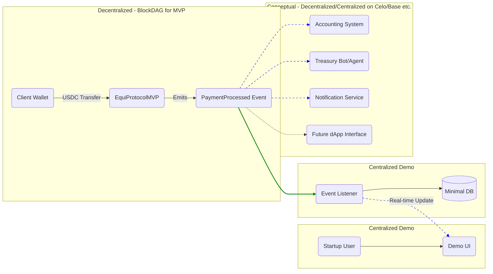

## 🏇 **_Equilibrio_ Meta-Protocol (`EquiProtocol`):   💱 Financial Operating System for   🦄 Crypto-Native Startups**

## To-dos

- [x] Migrate to Wagmi
- [x] Study CoperX UX, compare to EquiProtocol and design our UX/UI wireframe
      accordly (roughly in paper)
- [x] Use the 🏇 emoji for the app logo
- [x] Use the paper design as a prototipe and prompt v0 for an MVP interface,
      featuring both the **payment processor** for the **POS** and **electronic
      invoice** features
- [x] Fix proompted frontend (kind of)
- [ ] Connect wallet with Wagmi
- [ ] Deploy in Convex cloud
- [ ] Integrate Convex backend with Chef for the centralized **electronic
      invoice** _plugin_ and **POS** business logic
- [ ] Code and test core protocol contracts with the BlockDAG IDE; deploy them
      to Primordial testnet
- [ ] Implement USDC payment reception with Celo (MVP)
- [ ] Connect frontend to BlockDAG (MVP Demo)
- [ ] Connect to Celo (priority for production)
- [ ] Migrate to-do list to `TODO.md`
- [ ] Label version 0.0.1
- [ ] Then use Base, Arbitrum, etc.
- [ ] Add USDT support
- [ ] Support Celo native stablecoins

## 1. Executive Summary

Crypto-native startups face crippling financial fragmentation across payments,
treasury, accounting, and capital access, **a problem severely exacerbated in
regions like Panama and LATAM by the absence of modern global payment
infrastructure like Stripe.** **Equilibrio**, built upon the **EquiProtocol**
infrastructure layer, is the comprehensive financial OS designed to solve this.
Our hackathon MVP demonstrates the **core, non-negotiable foundation**: a
minimal, **decentralized** smart contract specifically for **USDC** payments
(chosen for its developer tools & transparency). This contract is deployed on
**BlockDAG**, leveraging its **innovative DAG architecture and swift transaction
finality** to vividly showcase the demo's crucial instant confirmation UX.
Crucially, this isn't just a wallet; it's the first step towards programmable,
automated financial operations built on a decentralized ledger. This validated
primitive proves the technical feasibility of the real-time, composable data
pipeline essential for the entire Equilibrio vision, with a clear path to
production on **Celo (priority for LATAM)** and other EVM chains.

---

## 2. The Problem: Financial Fragmentation Hampers Growth

Crypto-native startups, particularly in emerging markets like **Panama and wider
LATAM**, face critical operational challenges:

- **Infrastructure Gaps:** Lack of access to modern global payment platforms
  like **Stripe** forces reliance on fragmented, often legacy, local solutions
  (like Tilopay or ONVO Pay) with poor developer experience and limited
  features, especially for crypto-native needs.
  [[https://tilopay.com/](https://tilopay.com/),
  [https://onvopay.com/](https://onvopay.com/)]
- **Payment Acceptance Friction:** Limited ways to accept crypto payments,
  particularly trusted stablecoins like **USDC**, directly into treasury, often
  requiring cumbersome manual processes.
- **Treasury Inefficiency:** Capital sits idle without yield, or requires
  complex operations.
- **Accounting Complexity:** Reconciling on/off-chain transactions creates
  reporting nightmares.
- **Capital Access Barriers:** Fragmented financial data prevents access to
  credit against revenues.
- **Compliance Uncertainty:** Navigating regulatory requirements across
  jurisdictions burns resources.

This fragmentation forces teams to cobble together disparate solutions, wasting
engineering time, increasing costs, and slowing growth.

---

## 3. The Solution: EquiProtocol as the Composable Foundation for Equilibrio

**Equilibrio** is the vision: a unified financial OS providing crypto-native
startups with seamless payment processing, programmable treasury, automated
accounting, and DeFi-powered capital access.

**Why Not Just Use a Regular Wallet?**

A regular wallet receives funds, but the blockchain only sees a raw value
transfer (Address X sent Y to Address Z). For a _business_, this is
insufficient. It lacks context, structure, and the ability to trigger automated
workflows crucial for efficient operations. Manual reconciliation, tracking, and
triggering actions based on wallet receives is slow, error-prone, and doesn't
scale.

**EquiProtocol: Transforming Payments into Business Events on Appropriate
Chains**

Equilibrio requires **composability** and **automation** built on a
**trustworthy, decentralized base suitable for business needs**. EquiProtocol
provides this via a **decentralized smart contract** deployed on an appropriate
blockchain. This contract acts as the **programmable gateway**, transforming the
raw payment into a structured, verifiable _business event_ on-chain.

- **Structured Data via Events:** The contract emits a standardized
  `PaymentProcessed` event (merchant address, amount, timestamp), turning raw
  value into verifiable information.
- **Automation Trigger:** This reliable on-chain event acts as a signal that
  other services can listen for and react to automatically.
- **Future Context & Control:** Future versions will enrich this event (e.g.,
  with `invoiceId`) and allow for contract-level controls.

**Why USDC First?** While USDT holds a larger market cap, we strategically chose
**USD Coin (USDC)** for the initial implementation of EquiProtocol and the
Equilibrio OS for several key reasons crucial to building robust financial
infrastructure for businesses:

- **Developer Experience & Tooling:** Circle (USDC issuer) provides superior
  APIs, SDKs, and documentation, significantly accelerating development and
  simplifying the integration needed for reliable payment processing, treasury
  functions, and accounting automation within Equilibrio.
- **Transparency & Trust:** USDC has a stronger track record of transparency,
  with regular reserve attestations conducted by independent auditors. This
  builds greater trust, essential when businesses are relying on the platform
  for financial operations
  [[https://www.tokenmetrics.com/blog/usdt-vs-usdc](https://www.tokenmetrics.com/blog/usdt-vs-usdc)].
- **Regulatory Alignment:** USDC's proactive approach to compliance and
  regulation provides a potentially more stable foundation for a
  business-focused financial OS, particularly in regions navigating evolving
  crypto regulations
  [[https://www.tokenmetrics.com/blog/usdt-vs-usdc](https://www.tokenmetrics.com/blog/usdt-vs-usdc)].
- **Ecosystem Preference:** USDC is widely integrated and often preferred within
  the DeFi ecosystem, especially by protocols prioritizing compliance and
  long-term stability, aligning well with Equilibrio's vision
  [[https://www.muralpay.com/blog/usdc-vs-usdt-what-is-the-difference](https://www.muralpay.com/blog/usdc-vs-usdt-what-is-the-difference)].
  _(Support for USDT is planned for future iterations to maximize payment
  options.)_

**MVP: Validating the Decentralized Core (USDC) & Event Trigger on BlockDAG**

Our hackathon MVP focuses on the most critical piece: the **decentralized
`EquiProtocolMVP` smart contract** (handling **USDC** payments) and its **event
emission**. To _demonstrate_ the crucial **instant confirmation UX** effectively
within the limited timeframe, we strategically deployed this contract on
**BlockDAG**. We specifically utilized **BlockDAG's architecture, which allows for
high transaction throughput and rapid block confirmations**, resulting in the
near-instant finality (around 2-5s) vital for showcasing a responsive payment
system. BlockDAG's **EVM compatibility** also provided a familiar and efficient
development environment, streamlining the process of building and testing the core
smart contract logic.

This MVP validates the core mechanism using BlockDAG as a tool to prove the
concept with USDC. It establishes the foundation for production deployment on
chains selected for broader market fit.

**Future Equilibrio Vision (Enabled by the Composable EquiProtocol Foundation on
Celo, Base, etc.):**

- **Comprehensive Payment Suite:** Multi-currency (incl. USDT later),
  subscription management, invoicing.
- **Extensible Platform via Composability:** Deep integration with DeFi
  protocols (E.g. Aave, Uniswap, Curve, Balancer, Reserve), AI Agents, and
  third-party financial tools through standardized interfaces and a plugin
  ecosystem.

**Developer Experience (DX) Focused Design:**

EquiProtocol is designed with developer experience (DX) as a core principle, mirroring the flexibility and modularity found in tools like VSCode. The architecture emphasizes high modularity, allowing developers to integrate and extend the protocol with ease. A key aspect of this is the **standardized event structure** emitted by the smart contracts. This predictable data format simplifies the process for developers building applications and services on top of the protocol, as they can reliably consume and process these events regardless of the underlying chain. The codebase, structured with clear directories for `contracts`, `web` (frontend), and `dependencies`, further promotes a developer-friendly environment by organizing components logically and leveraging established tools like Foundry for smart contract development and testing. This modular approach means developers can interact with the protocol at various levels of complexity, from simply listening for core payment events to building sophisticated, custom financial workflows and interfaces.

**Open Infrastructure & Path to Decentralized Frontends:**

EquiProtocol is designed as an open, composable foundation. Post-hackathon, we
will provide an **Open-Source Frontend Template & Widgets**. This allows the
developer community to contribute modules and extensions, composing
sophisticated financial tools and potentially **building fully decentralized
interfaces (dApps)** on top of the core decentralized protocol demonstrated by
the MVP.

---

## 4. Hero Feature Spotlight: Instant Visual Confirmation - Enabled by BlockDAG for Demo

The **standout EquiProtocol MVP capability** is the **instant, real-time visual
confirmation** of **USDC** payments (~2-5s), served via our centralized demo UI.
This rapid confirmation is crucial for business UX. This was directly facilitated
by deploying the core smart contract on **BlockDAG**, taking advantage of its
**inherent speed and efficient processing of transactions**. The quick block
confirmation times on BlockDAG ensure that the `PaymentProcessed` event is
emitted and detected almost immediately after a payment occurs, allowing our demo
interface to provide near-instantaneous feedback to the user.

This showcases the successful reception of funds _into the decentralized
protocol contract_ and the immediate emission of the `PaymentProcessed` event.
The core value lies in transforming the raw payment into **structured,
actionable data** available on-chain, which acts as a **reliable trigger** for
future integrations, regardless of the underlying chain's finality speed in
production (which will be balanced with other factors like cost and adoption).

---

## 5. MVP Scope (Core Protocol Primitive Only)

Our MVP scope is deliberately minimalist, focusing exclusively on proving the
core **decentralized payment primitive** (handling **USDC** on BlockDAG for demo
speed) and its event emission for composability:

- **Core Functionality:**
  - **Decentralized Smart Contract (`EquiProtocolMVP.sol`):** Deployed on-chain
    (**BlockDAG for demo**, capitalizing on its **swift transaction handling**),
    receives **USDC**, emits a standardized `PaymentProcessed` event (structured
    data + automation trigger). This event structure is a key component of our
    DX-focused design, providing a predictable and easy-to-consume data stream
    for developers building on top of the protocol.
  - **Backend Listener:** _Demo component_ that detects the BlockDAG on-chain
    event.
  - **Frontend Demo:** _Demo component_ that consumes event data for visual
    confirmation.

- **Explicit Exclusions:**
  - **NO USDT Support (MVP):** Focus on USDC initially; USDT planned post-MVP.
  - **NO Fee Implementation:** Future concept only.
  - **NO Detailed Item/Invoice Data in Event:** Future scope. (MVP only confirms
    payment amount/merchant).
  - **NO Treasury Management / DeFi Integration:** Future feature post-MVP.
  - **NO Advanced UI/UX:** Minimal frontend focused on demonstrating the
    confirmation loop.
  - **NO Multi-Chain Support in MVP:** BlockDAG (and maybe Celo) only for MVP
    demo.
  - **NO Decentralized Frontend/Backend:** Demo components are hosted in
    centralized services for MVP feasibility.

1. **Day 1 (Foundation):**
   - Set up minimal development environment
   - Define `EquiProtocolMVP` contract interface (receive **USDC**, emit
     standardized event)
   - Build basic wallet connect integration

2. **Day 2 (Core Functions):**
   - Implement & test `EquiProtocolMVP` contract (incl. **USDC** handling, event
     emission). BlockDAG's **EVM compatibility** significantly eased the
     development and testing of the smart contract logic using familiar tools
     like Foundry.
   - Confirm smart contract compilation for Celo.
   - Deploy smart contract to **BlockDAG testnet** (for demo speed)
   - Create backend listener for payment events

3. **Day 3 (Integration & Demo):**
   - Connect frontend (consuming event), backend, and BlockDAG smart contract
     components. BlockDAG's **speedy confirmation** was essential for validating
     that the entire data pipeline from on-chain event to frontend update
     functions rapidly.
   - Implement visual confirmation UI
   - Test end-to-end **USDC** payment flow
   - Deploy demo and prepare presentation

---

## 6. Architecture Overview (Illustrating Composability via Events)

The architecture focuses on the minimal implementation needed to demonstrate the
**decentralized core payment primitive** (using BlockDAG for MVP demo, receiving
**USDC**) and its **event-driven composability potential**, using centralized
components for the demo interface:

_Diagram illustrates how the single `PaymentProcessed` Event (green arrow) from
the **Decentralized EquiProtocol Contract (on BlockDAG for MVP, handling USDC)**
is consumed by the MVP's backend/frontend, and conceptually enables multiple
future integrations (blue dashed arrows) on production chains like Celo,
including potentially decentralized ones._

In this architecture, **BlockDAG serves as the foundational decentralized layer
for the MVP**, specifically chosen for its **efficiency in processing
transactions and enabling rapid event emission** due to its unique DAG
structure. This swift event availability is critical for demonstrating the
real-time confirmation in the demo, showcasing the composability potential of
the protocol where off-chain or future on-chain services can reliably react to
these fast-flowing events originating from an immutable ledger. The **modular design** of the smart contract within the `contracts/src` directory, emitting a **standardized event**, is key to this composability, providing a clear and consistent interface for external services to interact with the protocol's core functionality.

---

## 7. User Experience (Proving the Foundation)

The MVP demo offers a simple, clean user experience via a **centralized
frontend**. Its true value lies in demonstrating the **technical execution** of
the underlying **decentralized protocol** required for the full Equilibrio OS:

- **Complexity Under Simplicity:** Successfully orchestrating the **secure,
  decentralized smart contract (for USDC)**, the standardized event emission,
  the real-time **centralized backend listener**, and the integration with
  **BlockDAG (specifically its rapid confirmation capabilities)** proves our
  team's capability to handle the core decentralized components essential for
  the full OS.

- **Focus on Core Value:** The experience centers on the **instant feedback
  loop** (~5s confirmation). This validates the core promise of real-time data
  availability originating from the **immutable, decentralized ledger** via a
  composable event stream – the bedrock of Equilibrio's automation
  capabilities. BlockDAG's performance in the MVP directly contributes to this
  real-time feel.

- **Minimal Flow (Validating the Primitive):**
  1. Connect Wallet (Business) - Demonstrates secure authentication.
  2. Receive payment address - Shows clear instruction.
  3. Customer sends **USDC** - Standard, familiar flow.
  4. **Experience Instant Visual Confirmation** - Proves the end-to-end data
     pipeline (**Decentralized Chain Contract Event** -> Centralized Backend ->
     Centralized Frontend) works reliably and quickly, significantly aided by
     BlockDAG's fast transaction processing. The **standardized format of the
     `PaymentProcessed` event** also plays a vital role in this, ensuring the backend
     listener can quickly and accurately interpret the on-chain data.

- **Visual Design:** Clean and functional, emphasizing clarity of the
  confirmation message and transaction details.

---

## 8. Community & Ecosystem Impact

EquiProtocol drives economic empowerment in two key communities:

- **Developer Community:** The open, composable infrastructure (starting with
  the standardized event from the decentralized contract deployed on BlockDAG
  for the MVP) invites contributions, creating a collaborative ecosystem of
  plugins, extensions, and **custom interfaces (including dApps)** built upon
  the core protocol. BlockDAG's **developer-friendly environment and EVM
  compatibility** are beneficial for this initial phase of building the core
  protocol and fostering early developer engagement. Our commitment to **Developer Experience (DX)**, seen in the modular contract design and standardized events, aims to lower the barrier to entry for developers wanting to build on EquiProtocol, making it easier to create new financial tools and integrations.

- **Crypto-Native Startups (esp. LATAM):** EquiProtocol lowers barriers to
  financial operations by providing the foundational layer for automation and
  integration on chains like **Celo**, chosen for their suitability to regional
  needs (mobile-first, low fees, stablecoins like **USDC/cUSD**). **Crucially,
  it provides a modern, programmable alternative in markets like Panama where
  global providers like Stripe are unavailable**, enabling local startups to
  compete globally. This enables teams to focus on core business rather than
  financial infrastructure.

**Future Use Case Example:** _Tourism-focused businesses in Panama could
leverage the EquiProtocol infrastructure and frontend template to create a
tailored payment solution for their industry, potentially forming a "TuriDAO"
(which uses the protocol itself) to govern their specific implementation and
pool resources for industry-wide initiatives._

---

## 9. Future Roadmap & Blockchain Strategy

The MVP validates the **decentralized core primitive (handling USDC)** on
BlockDAG (for demo purposes) and its initial composability via events. BlockDAG's
**speed and EVM compatibility** were valuable for this rapid prototyping phase.
Next steps involve building the Equilibrio OS on this proven foundation,
deepening composability, and deploying strategically across multiple chains:

1. **Targeted Multi-Chain Deployment:**
   - **Priority (LATAM Focus): Celo.** Deploy EquiProtocol contracts to Celo
     mainnet. **Why Celo?** Its mobile-first architecture aligns with LATAM's
     usage patterns, its focus on stablecoins (**USDC/cUSD**) meets regional
     business needs, and its low transaction fees make it viable for frequent
     operations and enhance financial inclusion.
   - **Broad Reach:** Deploy to **Base** and **Arbitrum** for access to their
     growing DeFi ecosystems and user bases.
   - **Explore:** Consider **Stellar** for specific cross-border payment use
     cases if relevant partnerships emerge.
2. **Core Financial OS Components:** Build modules (Treasury, Payments,
   Accounting) that consume data from the decentralized protocol events across
   deployed chains. The **modular architecture** of EquiProtocol's smart contracts and the **standardized event structure** will be fundamental to building these components efficiently and ensuring interoperability.
3. **Expand Stablecoin Support:** Integrate **USDT** into EquiProtocol smart
   contracts and the Equilibrio OS to offer broader payment options.
4. **Capital Access Layer:** Integrate with DeFi protocols like Aave via
   composable interfaces.
5. **Compliance Tools:** Integrate Chainlink for regulatory reporting
   automation.
6. **Developer Ecosystem & Deeper Composability:** Release SDK, documentation,
   standardized contract interfaces (beyond events) for direct on-chain
   interaction, enrichment of event data (e.g., `invoiceId`), and incentivize
   community contributions to the plugin ecosystem. Our focus on **DX** will be paramount here, providing developers with the tools and clear interfaces needed to build and contribute.
7. **Open-Source Frontend Template & dApp Path:** Release the frontend template
   to enable community-built interfaces, including fully decentralized dApps
   interacting directly with the EquiProtocol contracts on chains like Celo,
   Base, etc.

---

**(Note: Detailed contract code (`EquiProtocolMVP.sol`), technical architecture,
and testing procedures are available in the technical appendix/codebase.)**
