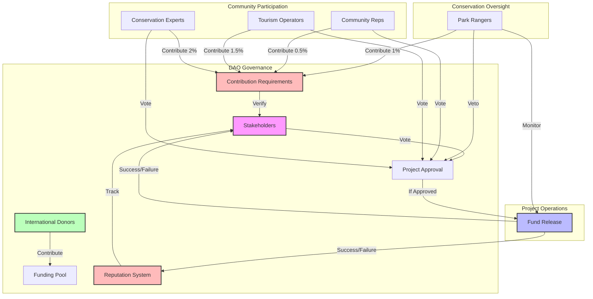

# **Eco-Grant DAO — Sustainable Tourism DAO for Protected Areas**

### ✨ Empowering communities to fund and manage sustainable tourism initiatives in protected areas

---

## **1. Executive Summary**

**Eco-Grant DAO** is a decentralized autonomous organization (DAO) that enables
international donors to fund sustainable tourism initiatives in protected areas
while ensuring local communities benefit from conservation efforts. Built on the
**BlockDAG Primordial Testnet**, we combine community-driven governance with
efficient funding mechanisms:

- 🌍 **Community Governance**: Local stakeholders vote on project funding and
  implementation
- 🔐 **Transparent Funding**: Public ledger for all donations and project
  expenditures
- 📊 **Sustainable Impact**: Focus on conservation and community development
- 💰 **Local Access**: Easy conversion between crypto and local currency

### Why Blockchain is Essential

While traditional funding mechanisms exist, blockchain is **crucial** for
Eco-Grant DAO because:

1. **Provable Community Control:**
   - Traditional models rely on trust in administrators
   - Blockchain enables verifiable, on-chain voting
   - Stakeholders can independently verify their influence
   - No centralized authority can override community decisions

2. **Unprecedented Donor Transparency:**
   - Traditional models: Annual reports, trust-based
   - Blockchain: Real-time, independently verifiable fund tracking
   - Every donation and disbursement is publicly recorded
   - Donors can audit fund usage without intermediaries

3. **Automated, Trust-Minimized Execution:**
   - Traditional: Manual fund release, human delays
   - Blockchain: Smart contracts execute based on verified votes
   - No single party controls fund release
   - Faster, more efficient fund distribution

4. **Global Access to Capital:**
   - Traditional: Limited by banking infrastructure
   - Blockchain: Anyone with crypto can participate
   - Lower barriers to international funding
   - Reduced transaction costs

### Core Value Proposition

Eco-Grant DAO provides a **community-driven funding mechanism** that:

1. **Empowers Local Stakeholders**: Park rangers, community members, and tourism
   operators collectively decide on projects
2. **Enables Global Support**: International donors can easily contribute to
   conservation efforts
3. **Ensures Sustainable Development**: Projects must balance tourism,
   conservation, and community needs

### How It Works

1. **DAO Governance Flow**:
   ```mermaid
   graph LR
       A[Stakeholders] -->|Vote| B[Project Proposals]
       B -->|Approval| C[Funding Pool]
       D[International Donors] -->|Contribute| C
       C -->|Release| E[Approved Projects]
       E -->|Implement| F[Local Communities]
   ```

2. **Funding Flow**:
   ```mermaid
   graph LR
       A[International Donor] -->|Crypto| B[DAO Treasury]
       B -->|Hold| C[Project Funds]
       D[Community Vote] -->|Approve| E[Smart Contract]
       E -->|Release| F[Local Currency]
       F -->|Deliver| G[Project Team]
   ```

### Core Benefits

1. **For Protected Areas**:
   - Sustainable funding for conservation
   - Community engagement in management
   - Infrastructure improvements
   - Better visitor experiences

2. **For Local Communities**:
   - Economic opportunities
   - Direct involvement in decisions
   - Skills development
   - Cultural preservation

3. **For International Donors**:
   - Transparent fund usage
   - Direct impact visibility
   - Community-driven projects
   - Sustainable tourism support

### Why Blockchain?

1. **Community Governance**:
   - Transparent voting
   - Immutable records
   - Fair token distribution
   - Automated execution

2. **Funding Efficiency**:
   - Lower transaction costs
   - Faster fund transfers
   - Global accessibility
   - Automated releases

3. **Impact Tracking**:
   - Public ledger
   - Project milestones
   - Fund allocation
   - Outcome measurement

### MVP Focus: Community-Driven Funding Simulation

During the **ETH Canal Hackathon**, we will develop a **functional MVP in one
week** demonstrating:

- 🔐 **DAO Setup**: Basic governance structure with stakeholder roles
- 💸 **Project Submission**: Simple proposal and voting mechanism
- 📱 **Funding Flow**: Complete donation and release process
- 👥 **Community Interface**: Basic dashboard for participation

### MVP Scope

#### What's IN Scope for the Hackathon:

- ✅ **Single Protected Area**: One area with defined stakeholders
- ✅ **Basic DAO Structure**: Simple voting and proposal system
- ✅ **Project Types**: Conservation, infrastructure, community programs
- ✅ **Funding Mechanism**: Crypto to local currency conversion
- ✅ **Minimal Dashboard**: Basic project and voting interface
- ✅ **Basic Reputation System**: Stakeholder reputation tracking
- ✅ **Simple Skin-in-Game**: Stakeholder contribution requirements
- ✅ **Documentation**: Clear process guides for all parties

#### What's NOT in Scope (Future Improvements):

- ❌ **Multiple Areas**: Full multi-area management
- ❌ **Advanced Analytics**: Detailed impact metrics
- ❌ **Complex Governance**: Full DAO feature set
- ❌ **Advanced Features**: Complex project structures
- ❌ **Multiple Currencies**: Full currency support
- ❌ **Advanced Reputation**: Complex reputation calculations
- ❌ **Token Economics**: Full token-based governance

### MVP Implementation

1. **Day 1-2: Smart Contracts**
   - Basic DAO structure
   - Voting mechanism
   - Fund management
   - Project release logic

2. **Day 3-4: Frontend Interface**
   - Project submission form
   - Voting interface
   - Basic dashboard
   - Donation mechanism

3. **Day 5: Integration**
   - Connect contracts to frontend
   - Test voting flows
   - Verify fund process

4. **Day 6-7: Testing & Documentation**
   - End-to-end testing
   - Documentation
   - Demo preparation

### Simplified MVP Flow

1. **Project Submission**:
   ```mermaid
   graph LR
       A[Community Member] -->|Submit| B[Project Proposal]
       B -->|Review| C[Stakeholder Vote]
       C -->|Approve| D[Funding Pool]
       E[International Donor] -->|Contribute| D
   ```

2. **Fund Release**:
   ```mermaid
   graph LR
       A[Funding Pool] -->|Release| B[Project Wallet]
       C[Project Progress] -->|Update| D[Community Review]
       D -->|Approve| A
       B -->|Convert| E[Local Currency]
       E -->|Deliver| F[Project Team]
   ```

### MVP Success Metrics

| Metric Category | Initial Target         | Measurement Method     |
| --------------- | ---------------------- | ---------------------- |
| Smart Contracts | Basic DAO working      | Contract testing       |
| Voting          | Proposal approval      | Process testing        |
| Fund Flow       | Complete cycle working | Transaction completion |
| User Experience | < 5 min voting time    | Time tracking          |
| Documentation   | Complete guide         | Community feedback     |

### Hackathon MVP Deliverables

- ✅ **Smart Contracts**: Basic DAO and voting
- ✅ **Community Dashboard**: Simple proposal interface
- ✅ **Donor Interface**: Basic donation mechanism
- ✅ **Documentation**: Process guides for all parties
- ✅ **Demo Video**: Complete end-to-end flow
- ✅ **Pitch Deck**: 10-slide presentation

### How Regular People Will Interact with Eco-Grant DAO (Post-MVP)

#### For International Donors:

1. **Browse Projects**: View community-approved initiatives
2. **Choose Project**: Select one to support
3. **Donate Crypto**: Transfer to project treasury
4. **Track Progress**: Monitor implementation
5. **See Impact**: View project outcomes

#### For Local Communities:

1. **Submit Projects**: Propose initiatives
2. **Participate in Voting**: Review and vote on proposals
3. **Implement Projects**: When approved and funded
4. **Report Progress**: Update community
5. **Track Impact**: Measure outcomes

#### For Protected Area Staff:

1. **Review Projects**: Assess feasibility
2. **Participate in Voting**: Ensure conservation alignment
3. **Monitor Implementation**: Track progress
4. **Support Communities**: Provide guidance
5. **Document Impact**: Record outcomes

**Key Point**: All blockchain complexity is hidden behind familiar interfaces.
Users never need to:

- Understand blockchain technology
- Handle private keys
- Deal with gas fees
- Worry about crypto volatility

### Governance Structure

1. **Stakeholder Roles (MVP Phase)**:
   - Park Rangers
   - Community Representatives
   - Conservation Experts
   - Tourism Operators
   - International Donors

2. **Voting Rights**:
   - Weighted by stakeholder type
   - Based on contribution level
   - Community majority required
   - Conservation veto rights

3. **Progressive Decentralization**:
   - Phase 1: Basic stakeholder voting
   - Phase 2: Expanded proposal types
   - Phase 3: Full community governance

### Governance Model



### Key Benefits

- **For Protected Areas**: Sustainable funding and community engagement
- **For Communities**: Economic opportunities and direct involvement
- **For Donors**: Transparent impact and sustainable tourism
- **For Conservation**: Balanced development and preservation

### Basic Reputation & Skin-in-Game (MVP)

1. **Stakeholder Roles & Requirements:**
   - **Park Rangers**: Must contribute 1% of project value
   - **Community Representatives**: Must contribute 0.5% of project value
   - **Conservation Experts**: Must contribute 2% of project value
   - **Tourism Operators**: Must contribute 1.5% of project value
   - **International Donors**: No minimum contribution

2. **Simple Reputation Tracking:**
   - **Voting Participation**: Track who votes on proposals
   - **Project Success**: Record successful project completions
   - **Contribution History**: Log stakeholder contributions
   - **Basic Score**: Simple 1-5 rating based on participation

3. **MVP Implementation:**
   - Basic smart contract for contribution tracking
   - Simple reputation score calculation
   - Contribution requirement verification
   - Basic UI for reputation display

4. **Future Expansion:**
   - More sophisticated reputation algorithms
   - Token-based governance
   - Reputation-based voting power
   - Advanced contribution mechanisms

---

## **2. Problem Statement**

Protected areas face critical challenges:

1. **Funding Gaps:**
   - Limited government resources
   - Unreliable donor funding
   - High operational costs
   - Infrastructure needs

2. **Community Engagement:**
   - Limited local participation
   - Economic opportunities needed
   - Skills development required
   - Cultural preservation

3. **Tourism Management:**
   - Balancing access and conservation
   - Infrastructure maintenance
   - Visitor experience quality
   - Sustainable practices

4. **Traditional Solutions Fall Short:**
   - Centralized foundations lack true community control
   - Manual processes slow down fund distribution
   - Limited transparency for international donors
   - High transaction costs for small donations
   - Complex bureaucracy for fund release

The solution must address all four:

- Sustainable funding mechanisms
- Community empowerment
- Balanced tourism development
- **Transparent, automated execution**

---

## **3. The Eco-Grant DAO Solution**

Eco-Grant DAO creates a DAO that enables international donors to fund
sustainable tourism initiatives while ensuring local communities benefit from
conservation efforts:

### Community Operations

1. **Project Submission Process**:
   ```mermaid
   graph TD
       A[Community Need] -->|Identify| B[Project Proposal]
       B -->|Define| C[Objectives & Budget]
       C -->|Submit| D[DAO Review]
       D -->|Vote| E[Stakeholder Approval]
       E -->|Funds| F[International Donors]
       F -->|Contribute| G[Project Treasury]
   ```

2. **Implementation Process**:
   ```mermaid
   graph TD
       A[Approved Project] -->|Plan| B[Implementation]
       B -->|Progress| C[Community Review]
       C -->|Update| D[Smart Contract]
       D -->|Release| E[Project Funds]
       E -->|Convert| F[Local Currency]
       F -->|Deliver| G[Project Team]
       G -->|Complete| H[Impact Assessment]
   ```

3. **Governance Features**:
   - Stakeholder voting
   - Conservation oversight
   - Progress tracking
   - Impact measurement
   - Regular audits

### Protocol Governance

1. **Stakeholder Structure (MVP)**:
   - Park Rangers (Conservation)
   - Community Representatives (Local)
   - Tourism Operators (Business)
   - International Donors (Funding)

2. **Project Categories**:
   - Conservation initiatives
   - Infrastructure improvements
   - Community programs
   - Tourism development

3. **Progressive Decentralization**:
   - Phase 1: Basic stakeholder voting
   - Phase 2: Expanded proposal types
   - Phase 3: Full community governance

---

## **4. Core Features**

### 🔐 DAO Governance

1. **Voting Structure**:
   - Stakeholder roles
   - Weighted voting
   - Proposal types
   - Approval thresholds

2. **Project Controls**:
   - Conservation alignment
   - Community benefit
   - Budget limits
   - Timeline tracking

3. **Operational Standards**:
   - Project verification
   - Progress reporting
   - Impact assessment
   - Security protocols

### 💰 Fund Management

1. **Treasury Structure**:
   - Project-based allocation
   - Automated releases
   - Transparent tracking
   - Impact measurement

2. **Currency Conversion**:
   - Crypto to local
   - Fixed rates
   - Transparent fees
   - Regular reconciliation

3. **Verification Process**:
   - Community review
   - Progress updates
   - Impact assessment
   - Blockchain records

### 📱 Community Interface

- Web dashboard features:
  - Project submission
  - Voting mechanism
  - Progress tracking
  - Impact reporting

---

## **5. MVP Success Metrics**

| Metric Category | Initial Target         | Measurement Method     |
| --------------- | ---------------------- | ---------------------- |
| Smart Contracts | Basic DAO working      | Contract testing       |
| Voting          | Proposal approval      | Process testing        |
| Fund Flow       | Complete cycle working | Transaction completion |
| User Experience | < 5 min voting time    | Time tracking          |
| Documentation   | Complete guide         | Community feedback     |

### MVP Infrastructure

1. **Protocol Systems**:
   - Basic DAO contracts
   - Voting mechanism
   - Fund management
   - Upgrade mechanisms

2. **Local Systems**:
   - Project tracking
   - Progress reporting
   - Basic dashboard
   - Impact assessment

### Hackathon MVP Deliverables

- ✅ **Smart Contracts**: Basic DAO and voting
- ✅ **Community Dashboard**: Simple proposal interface
- ✅ **Donor Interface**: Basic donation mechanism
- ✅ **Documentation**: Process guides for all parties
- ✅ **Demo Video**: Complete end-to-end flow
- ✅ **Pitch Deck**: 10-slide presentation
