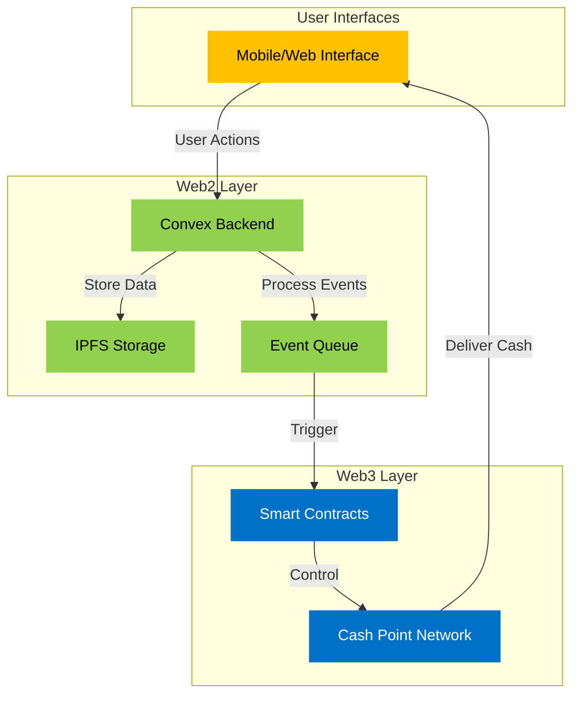
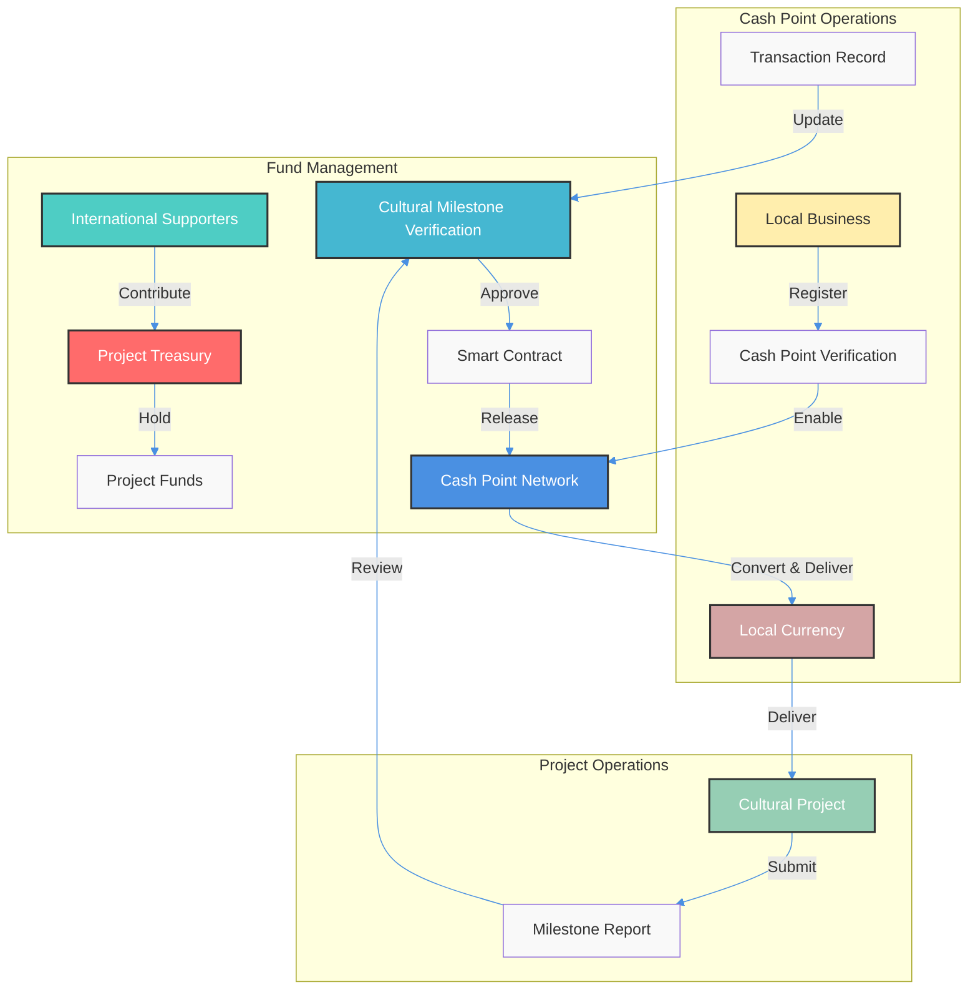
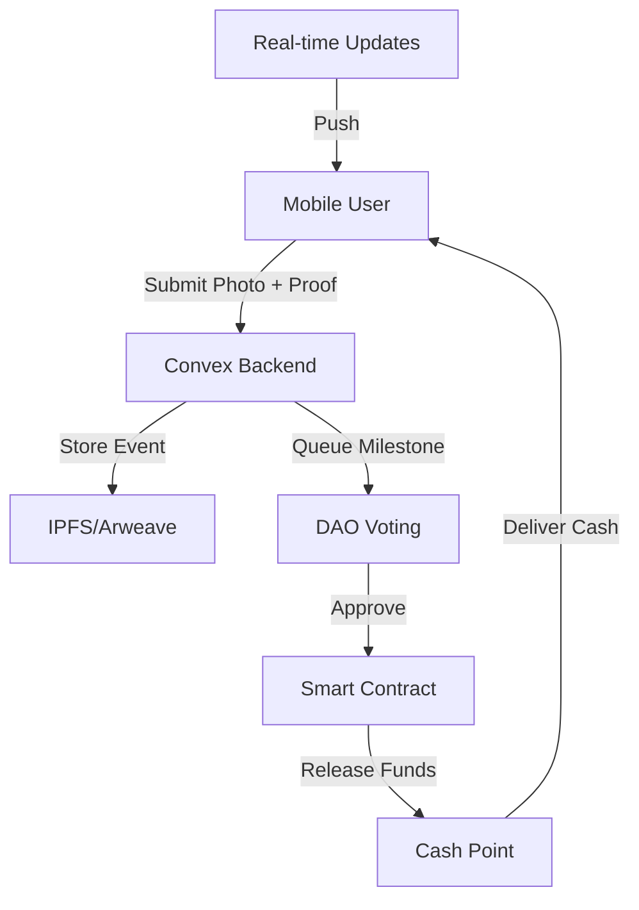

# **Finartisan Protocol — Artisanal Finance for Cultural Heritage**

### ✨ Bridging traditional craftsmanship with modern financial infrastructure

---

## **1. Executive Summary**

**Finartisan Protocol** is a decentralized system that enables international
supporters to fund rural cultural initiatives by bridging the gap between crypto
funding and local cash economies. Built on the **BlockDAG Primordial Testnet**,
we combine smart contracts with local cash distribution networks:

- 🌍 **Cultural Financial Bridge**: Connect crypto funding to rural cultural
  economies
- 🔐 **Transparent Tracking**: Public ledger for all donations and expenditures
- 📱 **Mobile-First Access**: Simple interface for areas with limited
  connectivity
- 💰 **Local Cash Points**: Network of trusted local businesses for fund
  distribution

### Why BlockDAG?

We chose the BlockDAG Primordial Testnet for its:

- Parallel execution model enabling faster rural transactions
- Low-latency confirmation ideal for mobile-first UX
- EVM compatibility for familiar development
- High throughput for scaling cultural initiatives

### Technical Architecture



### Technical Stack

1. **Frontend**:
   - Next.js + Tailwind + shadcn/ui
   - Wagmi + RainbowKit for wallet integration
   - Mobile-first responsive design
   - Vercel deployment

2. **Backend (Convex)**:
   - Real-time data sync
   - IPFS integration for proofs
   - Event queuing system
   - Session management

3. **Smart Contracts**:
   - Foundry + Solidity
   - CampaignFactory for project creation
   - Campaign with milestone logic
   - CashPoint for local distribution

### Security Implementation

1. **Fund Management**:
   - Multi-signature treasury
   - Time-lock mechanisms
   - Event-based validation

2. **Data Security**:
   - IPFS document storage
   - Encrypted metadata
   - Access control

3. **User Protection**:
   - Rate limiting
   - Input validation
   - Replay protection

### MVP Implementation (7 Days)

| Day       | Focus            | Deliverable                                         |
| --------- | ---------------- | --------------------------------------------------- |
| **Day 1** | Contracts        | Write + test `CampaignFactory` + `Campaign`         |
| **Day 2** | Frontend Boot    | Wallet connect, testnet contract deploy, basic UI   |
| **Day 3** | Milestone UX     | Implement milestone release logic + verifier action |
| **Day 4** | Cash Points      | Add fake registry + display logic                   |
| **Day 5** | Polish           | Add campaign dashboard + UX details                 |
| **Day 6** | Presentation     | Write pitch deck, record demo                       |
| **Day 7** | Testing + Deploy | Deploy dapp + repo polish + practice pitch          |

### What's NOT in Scope (Future Improvements)

- ❌ **Multiple Regions**: Full multi-area management
- ❌ **Advanced Analytics**: Detailed impact metrics
- ❌ **Complex Governance**: Full protocol feature set
- ❌ **Advanced Features**: Complex project structures
- ❌ **Multiple Currencies**: Full currency support
- ❌ **Advanced Verification**: Complex verification mechanisms
- ❌ **Token Economics**: Full token-based governance
- ❌ **Oracles**: Real-time data feeds and automated verification
- ❌ **Full KYC Process**: Using pre-verified cash points for demo
- ❌ **Community Voting**: Simplified verification for MVP
- ❌ **Complete Mobile App**: Mobile-friendly web interface only

### Hackathon Information

#### About Partners

- **BlockDAG**: Next-generation blockchain protocol enabling high-throughput
  EVM-compatible applications
- **ETH Canal**: Panamanian-led Ethereum ecosystem platform fostering innovation
  across LATAM
- **Innovation Smart District**: Catalyst for innovation combining AI,
  blockchain, and gaming

#### Judging Criteria

| Criteria                 | Description                              | Score |
| ------------------------ | ---------------------------------------- | ----- |
| Innovation & Originality | How creative and unique the project is   | 25%   |
| Technical Execution      | Technical depth and accuracy             | 25%   |
| Feasibility & Impact     | Practical use-case and real-world impact | 25%   |
| Quality of Presentation  | Clarity and effectiveness                | 25%   |

#### Submission Guidelines

| Deliverable | Details                          |
| ----------- | -------------------------------- |
| Demo video  | 3–5 minutes of working prototype |
| Pitch deck  | Maximum 10 slides                |
| Team video  | Maximum 3 minutes                |
| GitHub repo | Link to codebase                 |

### Off-Ramp Solution

Finartisan Protocol provides a **specialized off-ramp solution** that:

1. **Crypto to Cash Conversion**:
   - Accepts crypto donations from international supporters
   - Converts to local currency through verified cash points
   - Enables immediate cash access for cultural projects
   - Maintains transparent conversion records

2. **Local Distribution Network**:
   - Partners with trusted local businesses as cash points
   - Provides mobile interface for fund access
   - Enables cash withdrawals at verified locations
   - Supports offline verification

3. **Smart Contract Management**:
   - Automated fund releases based on milestones
   - Transparent tracking of all conversions
   - Secure escrow for project funds
   - Verifiable transaction history

4. **Cultural Project Support**:
   - Direct cash access for traditional artisans
   - Local currency support for cultural events
   - Flexible withdrawal options
   - Community-based verification

### KYC & Verification Process

1. **Cash Point Onboarding**:
   - Organizer verification OR two local references required
   - Basic business documentation
   - Community endorsement process
   - Regular compliance checks

2. **Milestone Verification**:
   - Human verifiers receive progress reports via mobile forms
   - Photo documentation of cultural activities
   - Simple form-based approval process
   - On-chain signatures for fund releases

3. **Fiat Conversion (MVP)**:
   - Custodial multisigs holding pre-seeded test tokens
   - 1:1 token-to-fiat representation
   - Simulated local currency delivery
   - Transparent conversion tracking

### Why Blockchain is Essential

While traditional cultural funding mechanisms exist, blockchain is **crucial**
for this protocol because:

1. **Transparent Fund Tracking:**
   - Traditional: Cash-based, difficult to audit
   - Blockchain: Real-time, independently verifiable fund tracking
     - Every donation and disbursement is publicly recorded
     - Supporters can audit fund usage without intermediaries

2. **Automated Fund Releases:**
   - Traditional: Manual cash distribution, security risks
   - Blockchain: Smart contracts execute based on verified milestones
     - No single party controls fund release
     - Faster, more efficient fund distribution

3. **Global Accessibility:**
   - Traditional: Limited by banking infrastructure
   - Blockchain: Anyone with crypto can participate
     - Lower barriers to international funding
     - Reduced transaction costs

4. **Cultural Preservation:**
   - Traditional: Funds often bypass local communities
   - Blockchain: Direct support to cultural initiatives
     - Local community participation
     - Sustainable cultural development

### Core Value Proposition

Finartisan Protocol provides a **rural cultural financial system** that:

1. **Bridges Crypto to Cash**: Enables rural cultural initiatives to use
   international funding
2. **Creates Local Networks**: Partners with businesses as cultural cash points
3. **Ensures Transparent Tracking**: Every transaction is publicly verifiable
4. **Supports Cultural Heritage**: Preserves and promotes local traditions

### How It Works

1. **Off-Ramp Flow**:
   ```mermaid
   graph LR
       A[International Supporter] -->|Crypto| B[Cultural Projects Treasury]
       B -->|Hold| C[Project Funds]
       D[Cultural Milestone Verification] -->|Approve| E[Smart Contract]
       E -->|Release| F[Local Cash Point]
       F -->|Convert & Deliver| G[Cultural Initiative]
       H[Local Business] -->|Register| I[Cash Point Verification]
       I -->|Enable| F
   ```

2. **Cash Point Network Flow**:
   ```mermaid
   graph LR
       A[Local Business] -->|Register| B[Cultural Cash Point Network]
       B -->|Verify| C[Smart Contract]
       C -->|Enable| D[Fund Distribution]
       E[Cultural Project] -->|Request Cash| F[Mobile Interface]
       F -->|Locate| G[Nearest Cash Point]
       G -->|Convert & Deliver| H[Local Currency]
   ```

3. **Conversion Process**:
   ```mermaid
   graph TD
       A[Project Request] -->|Submit| B[Milestone Verification]
       B -->|Approve| C[Smart Contract]
       C -->|Release| D[Cash Point Network]
       D -->|Convert| E[Local Currency]
       E -->|Deliver| F[Project Team]
       G[Transaction Record] -->|Update| H[Blockchain Ledger]
   ```

### Core Benefits

1. **For Supporters**:
   - Transparent fund usage
   - Direct cultural impact
   - Lower transaction costs
   - Rural reach capability

2. **For Cultural Projects**:
   - Immediate cash access
   - Local currency support
   - Mobile-based interface
   - Flexible withdrawal options

3. **For Local Businesses**:
   - Additional revenue stream
   - Community service
   - Network participation
   - Cultural preservation role

4. **For Cultural Heritage**:
   - More funds reach projects
   - Local economic boost
   - Community engagement
   - Sustainable preservation

### Why Blockchain?

1. **Transparency**:
   - Public ledger
   - Verifiable transactions
   - Immutable records
   - Independent auditing

2. **Efficiency**:
   - Lower transaction costs
   - Faster fund transfers
   - Automated releases
   - Reduced bureaucracy

3. **Cultural Access**:
   - Mobile money integration
   - Cash point networks
   - Offline capabilities
   - Local currency support

### MVP Focus: Cultural Financial Access

During the **ETH Canal Hackathon**, we will develop a **functional MVP**
demonstrating core off-ramp functionality in 7 days:

#### Must-Have Features (7-Day Reality Check)

1. **Smart Contract Core**:
   - Project creation flow (wallet signs to deploy campaign contract)
   - Milestone-based fund release logic
   - Simplified custody through multisig treasury
   - Test token representation (no real fiat conversion)

2. **Basic Frontend**:
   - Wallet connection (wagmi/RainbowKit)
   - Project creation interface
   - Milestone approval dashboard
   - Cash point registry display
   - Mobile-friendly UI (responsive design)

3. **Demo-Ready Features**:
   - Pre-configured test environment
   - Hardcoded cash points (2-3 valid points)
   - Basic milestone verification
   - Onchain status tracking

#### Technical Stack

1. **Frontend**:
   - Next.js + Tailwind + shadcn/ui
   - Vercel for instant preview deploys
   - Wallet-only authentication

2. **Smart Contracts**:
   - Foundry + Solidity (Primordial-compatible)
   - CampaignFactory contract
   - Campaign contract with milestone logic
   - Simple milestone structs

3. **Backend**:
   - Minimal metadata storage
   - Basic project tracking
   - Simple verification logic

### 7-Day Execution Plan

| Day       | Focus            | Deliverable                                         |
| --------- | ---------------- | --------------------------------------------------- |
| **Day 1** | Contracts        | Write + test `CampaignFactory` + `Campaign`         |
| **Day 2** | Frontend Boot    | Wallet connect, testnet contract deploy, basic UI   |
| **Day 3** | Milestone UX     | Implement milestone release logic + verifier action |
| **Day 4** | Cash Points      | Add fake registry + display logic                   |
| **Day 5** | Polish           | Add campaign dashboard + UX details                 |
| **Day 6** | Presentation     | Write pitch deck, record demo                       |
| **Day 7** | Testing + Deploy | Deploy dapp + repo polish + practice pitch          |

### MVP Success Metrics

| Metric Category   | Initial Target         | Measurement Method     |
| ----------------- | ---------------------- | ---------------------- |
| Smart Contracts   | Basic system working   | Contract testing       |
| Fund Flow         | Complete cycle working | Transaction completion |
| Cash Distribution | Local delivery working | Process testing        |
| User Experience   | < 5 min access time    | Time tracking          |
| Documentation     | Complete guide         | User feedback          |
| Demo Readiness    | All flows working      | Scenario testing       |

### MVP Infrastructure

1. **Protocol Systems**:
   - Basic smart contracts
   - Manual verification process
   - Fund management
   - Demo environment

2. **Project Systems**:
   - Project tracking
   - Progress reporting
   - Basic dashboard
   - Test scenarios

### Post-MVP Roadmap

1. **Phase 1: Enhanced Verification**
   - Oracle integration for exchange rates
   - Automated cash point verification
   - Real-time compliance checks
   - Advanced milestone tracking

2. **Phase 2: Network Expansion**
   - Multiple region support
   - Advanced analytics
   - Full governance features
   - Token economics

3. **Phase 3: Production Features**
   - Complete oracle integration
   - Advanced security features
   - Full regulatory compliance
   - Enterprise features
   - Ecosystem token introduction for:
     - Gas abstraction
     - Contributor incentives
     - Impact scoring
     - Cultural preservation metrics

### How Regular People Will Interact with Finartisan Protocol (Post-MVP)

#### For International Supporters:

1. **Browse Projects**: View verified cultural initiatives
2. **Choose Project**: Select one to support
3. **Donate Crypto**: Transfer to project treasury
4. **Track Progress**: Monitor milestone completion
5. **See Impact**: View cultural outcomes

#### For Cultural Projects:

1. **Submit Proposal**: Define project and milestones
2. **Access Funds**: Visit local cash points
3. **Report Progress**: Submit milestone documentation
4. **Receive Releases**: Get cash as milestones verified
5. **Track Impact**: Measure and report outcomes

#### For Local Businesses:

1. **Register**: Join cash point network
2. **Verify**: Complete basic checks
3. **Distribute**: Handle local cash releases
4. **Report**: Update transaction status

**Key Point**: All blockchain complexity is hidden behind familiar interfaces.
Users never need to:

- Understand blockchain technology
- Handle private keys
- Deal with gas fees
- Worry about crypto volatility

### Protocol Structure

1. **Core Components (MVP Phase)**:
   - Smart Contracts (Fund Management)
   - Cash Point Network
   - Mobile Interface
   - Reporting System

2. **Fund Release Process**:
   - Milestone-based releases
   - Cash point verification
   - Automated distribution
   - Transparent tracking

3. **Progressive Development**:
   - Phase 1: Basic cash distribution
   - Phase 2: Enhanced verification
   - Phase 3: Advanced analytics

### Protocol Model



### Key Benefits

- **For Supporters**: Transparent fund usage and cultural impact visibility
- **For Projects**: Local cash access and mobile-based interface
- **For Local Businesses**: Additional revenue and cultural preservation role
- **For Cultural Heritage**: More funds reach projects and local economic boost

### Basic Verification Process (MVP)

1. **Milestone Structure:**
   - **Project Setup**: Initial verification of cultural viability
   - **Progress Milestones**: Regular checkpoints (e.g., quarterly)
   - **Completion Verification**: Final assessment of outcomes
   - **Impact Reporting**: Documentation of cultural results

2. **Simple Verification Tracking:**
   - **Submission Timeliness**: Track when reports are submitted
   - **Milestone Completion**: Record successful milestone achievements
   - **Documentation Quality**: Assess completeness of reporting
   - **Basic Score**: Simple 1-5 rating based on verification

3. **MVP Implementation:**
   - Basic smart contract for milestone tracking
   - Simple verification workflow
   - Documentation requirements
   - Basic UI for verification display

4. **Future Expansion:**
   - More sophisticated verification mechanisms
   - Advanced impact assessment
   - Reputation-based verification
   - Automated verification tools

---

## **2. Problem Statement**

Rural cultural projects face critical challenges:

1. **Financial Access:**
   - Limited banking infrastructure
   - High cash handling costs
   - Security risks
   - Travel requirements

2. **Project Management:**
   - Inconsistent reporting
   - Limited oversight
   - Slow approval processes
   - Poor tracking

3. **Impact Verification:**
   - Difficult to verify outcomes
   - Limited transparency
   - Inconsistent standards
   - Slow feedback loops

4. **Traditional Solutions Fall Short:**
   - Bank branches too far
   - Mobile money limited
   - Cash transport risky
   - High transaction costs

The solution must address all four:

- Local financial access
- Standardized project management
- Verifiable impact tracking
- **Transparent, automated execution**

---

## **3. The Finartisan Protocol Solution**

Finartisan Protocol creates a rural cultural financial access system that
enables international supporters to fund cultural projects through local cash
points:

### Protocol Operations

1. **Project Submission Process**:
   ```mermaid
   graph TD
       A[Cultural Need] -->|Identify| B[Project Proposal]
       B -->|Define| C[Objectives & Milestones]
       C -->|Submit| D[Initial Verification]
       D -->|Approve| E[Project Treasury]
       F[International Supporter] -->|Contribute| E
   ```

2. **Implementation Process**:
   ```mermaid
   graph TD
       A[Approved Project] -->|Plan| B[Implementation]
       B -->|Progress| C[Milestone Reporting]
       C -->|Verify| D[Smart Contract]
       D -->|Release| E[Cash Point Network]
       E -->|Deliver| F[Project Team]
       F -->|Complete| G[Impact Assessment]
   ```

3. **Protocol Features**:
   - Milestone verification
   - Cash point network
   - Progress tracking
   - Impact measurement
   - Regular audits

### Protocol Structure

1. **Core Components (MVP)**:
   - Smart Contracts (Fund Management)
   - Cash Point Network
   - Mobile Interface
   - Reporting System

2. **Project Categories**:
   - Cultural preservation
   - Traditional crafts
   - Local festivals
   - Heritage sites
   - Community programs

3. **Progressive Development**:
   - Phase 1: Basic cash distribution
   - Phase 2: Enhanced verification
   - Phase 3: Advanced analytics

---

## **4. Core Features**

### 🔐 Fund Management

1. **Treasury Structure**:
   - Project-based allocation
   - Milestone-based releases
   - Transparent tracking
   - Impact measurement

2. **Cash Distribution**:
   - Local cash points
   - Transparent tracking
   - Automated releases
   - Mobile integration

3. **Verification Process**:
   - Milestone review
   - Progress updates
   - Impact assessment
   - Blockchain records

### 💰 Cash Point Network

1. **Network Structure**:
   - Business registration
   - Verification process
   - Transaction handling
   - Reporting system

2. **Distribution Mechanism**:
   - Local cash management
   - Transaction recording
   - Transparent tracking
   - Regular audits

3. **Mobile Integration**:
   - Simple interface
   - Offline capability
   - Transaction updates
   - Status reporting

### 📱 Mobile Interface

- Web/mobile dashboard features:
  - Project submission
  - Cash point location
  - Progress tracking
  - Impact reporting

---

## **5. MVP Success Metrics**

| Metric Category   | Initial Target         | Measurement Method     |
| ----------------- | ---------------------- | ---------------------- |
| Smart Contracts   | Basic system working   | Contract testing       |
| Fund Flow         | Complete cycle working | Transaction completion |
| Cash Distribution | Local delivery working | Process testing        |
| User Experience   | < 5 min access time    | Time tracking          |
| Documentation     | Complete guide         | User feedback          |

### MVP Infrastructure

1. **Protocol Systems**:
   - Basic smart contracts
   - Cash point mechanism
   - Fund management
   - Upgrade mechanisms

2. **Project Systems**:
   - Project tracking
   - Progress reporting
   - Basic dashboard
   - Impact assessment

### Hackathon MVP Deliverables

- ✅ **Smart Contracts**: Basic fund management and cash distribution
- ✅ **Mobile Interface**: Simple project and cash point access
- ✅ **Donor Interface**: Basic donation mechanism
- ✅ **Documentation**: Process guides for all parties
- ✅ **Demo Video**: Complete end-to-end flow
- ✅ **Pitch Deck**: 10-slide presentation

---

## **6. Hackathon Information**

### About Partners

#### BlockDAG

A next-generation blockchain protocol enabling high-throughput EVM-compatible
applications. BlockDAG provides the HackerEarth platform for this Hackathon and
supports developers building on its Primordial Testnet.

#### ETH Canal (by C10N, S.A.)

A Panamanian-led Ethereum ecosystem platform fostering innovation across LATAM
through education, collaboration, and real-world blockchain adoption.

#### Innovation Smart District (ISD)

A catalyst for innovation, combining AI, blockchain, biotech, robotics, and
gaming into a physical and digital environment to empower global innovation.

### Judging Criteria

| Criteria                  | Description                                                            | Score (out of 25%) |
| ------------------------- | ---------------------------------------------------------------------- | ------------------ |
| Innovation & Originality  | How creative, novel, or unique the project is.                         | 25%                |
| Technical Execution       | The technical depth and accuracy of the implementation.                | 25%                |
| Feasibility & Impact      | Practical use-case, potential reach, and real-world impact.            | 25%                |
| Quality of Presentation   | Clarity and effectiveness in communicating the project.                | 25%                |
| Testability & Scalability | Potential to test, expand, or scale the project (bonus consideration). | Bonus              |

_Judges' decisions are final._

### Submission Guidelines

#### Submission Format

| Deliverable             | Details                                                   |
| ----------------------- | --------------------------------------------------------- |
| Demo video              | 3–5 minutes of the working prototype                      |
| Pitch deck              | Maximum 10 slides explaining the project                  |
| Team introduction video | Maximum 3 minutes introducing team members                |
| GitHub repository       | Link to the codebase (open source preferred)              |
| Optional documentation  | Additional documentation or architecture diagram (if any) |

### Technical Architecture

#### Hybrid Web2 + Web3 Approach

Finartisan Protocol uses a **pragmatic hybrid architecture** that combines
blockchain security with Web2 usability:

1. **Smart Contracts (Source of Truth)**:
   - Fund management and releases
   - Milestone verification
   - DAO governance
   - On-chain state

2. **Web2 Bridge Layer (UX Enhancement)**:
   - Real-time updates via Convex
   - Off-chain metadata storage
   - Mobile-friendly session management
   - Event queuing and batching

#### Architecture Flow



#### Technical Stack

1. **Frontend**:
   - Next.js + Tailwind + shadcn/ui
   - Vercel for instant preview deploys
   - Wallet-only authentication
   - Mobile-first responsive design

2. **Backend (Convex)**:
   - Real-time data sync
   - Off-chain metadata
   - Session management
   - Event queuing
   - IPFS integration

3. **Smart Contracts**:
   - Foundry + Solidity
   - CampaignFactory
   - Campaign with milestones
   - DAO governance

4. **Storage**:
   - IPFS/Arweave for proofs
   - Convex for metadata
   - On-chain for final state

#### Why Hybrid Architecture?

1. **Rural UX Requirements**:
   - Offline-first capabilities
   - Lightweight mobile interface
   - Fast response times
   - Progressive enhancement

2. **Security Benefits**:
   - Smart contracts as source of truth
   - Immutable fund management
   - Transparent verification
   - Decentralized governance

3. **Practical Advantages**:
   - Faster development
   - Better user experience
   - Easier maintenance
   - Progressive rollout

### MVP Implementation

1. **Day 1-2: Core Infrastructure**
   - Smart contract development
   - Convex backend setup
   - Basic frontend structure
   - IPFS integration

2. **Day 3-4: User Experience**
   - Mobile interface development
   - Real-time updates
   - Offline capabilities
   - Session management

3. **Day 5: Integration**
   - Connect all components
   - Test fund flows
   - Verify cash distribution
   - Setup demo environment

4. **Day 6-7: Polish & Deploy**
   - End-to-end testing
   - Documentation
   - Demo preparation
   - Deployment
