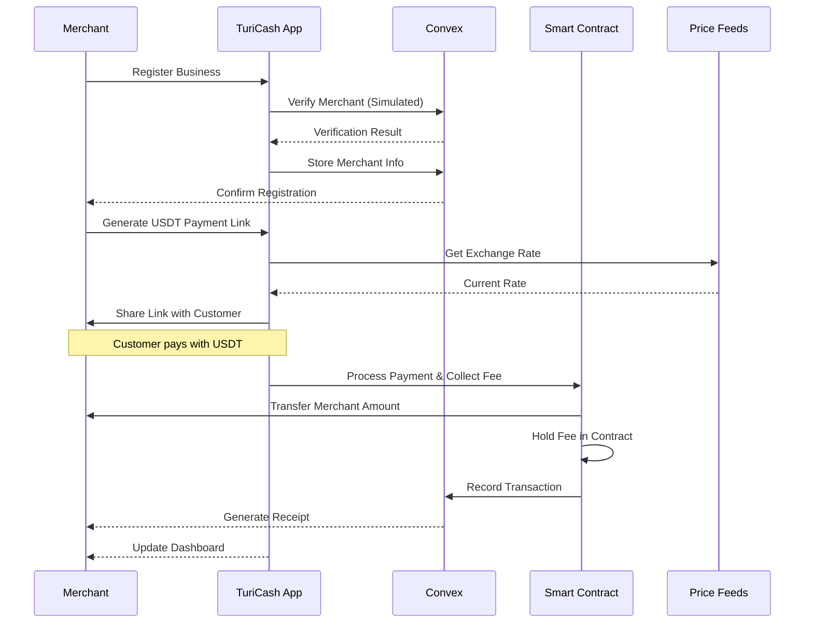

# 🌎 **TuriCash DAO: Empowering Panama's Tourism Communities**

## 📌 Summary

**TuriCash DAO** is a payment platform designed specifically for Panama's
tourism communities. We transform how local tourism businesses handle payments
by enabling them to accept stablecoin payments from international tourists,
creating verifiable financial records, and building a community fund for local
tourism development.

For the ETH Canal hackathon, we're focusing on a minimal viable product that
demonstrates our core value proposition: enabling Panamanian tourism businesses
to accept USDT payments and build verifiable financial history.

---

## 🎯 Why Panama's Tourism Communities Need TuriCash

### The Tourism Payment Challenge in Panama

Panama's tourism sector is growing rapidly, with over 2 million visitors
annually, but local businesses face significant payment challenges:

- **Tour Guides in Bocas del Toro:** Struggle to accept advance payments from
  international tourists, losing potential bookings.
- **Artisans in Casco Viejo:** Miss sales from tourists who prefer digital
  payments over cash.
- **Small Hotels in Boquete:** Face high fees (5-7%) from traditional payment
  processors, eating into margins.
- **Restaurants in Panama City:** Struggle with seasonal cash flow management,
  unable to secure loans due to lack of verifiable income history.

### The Cash Management Problem

Tourism businesses in Panama operate in a cash-heavy environment, creating
significant challenges:

- **Lost Opportunities:** No digital records mean no access to business loans.
  Traditional lenders require 2-3 years of bank statements, which cash-only
  businesses can't provide.
- **Limited Growth:** Can't prove income for expansion or partnerships with
  larger tourism operators.
- **Operational Inefficiency:** Manual cash tracking consumes valuable time that
  could be spent on business development.
- **Market Visibility:** Stay invisible to digital tourism platforms that
  require integrated payment solutions.

---

## 💡 The TuriCash Solution (Hackathon MVP)

For the ETH Canal hackathon, we're focusing on a minimal viable product that
demonstrates our core value proposition:

### 1. USDT Payment Acceptance

- Simple merchant registration with basic verification
- Payment link generation
- Basic transaction recording

### 2. Verifiable Financial History

- On-chain transaction recording
- Basic dashboard
- Exportable records

### 3. Community Fund

- 1.8% transaction fee handling
- Basic fund balance tracking
- Secure atomic fee collection via smart contract
- Transparent fee distribution and tracking

### 4. Community Development Program

- **Local Tourism Development**
  - Infrastructure improvements for tourism areas
  - Training and education programs for local businesses
  - Marketing support for small tourism operators
  - Sustainable tourism initiatives

- **Fund Allocation**
  - Community-driven proposal system
  - Transparent voting mechanism for fund usage
  - Priority for local development projects
  - Support for small business growth initiatives

- **Governance Structure**
  - Local business representation in decision-making
  - Community-driven fund management
  - Regular reporting and accountability
  - Measurable impact tracking

---

## 🔗 Web3 Architecture (MVP)

### Convex Backend

- Merchant registration and management
- Transaction recording and history
- Basic analytics and reporting
- Simulated merchant verification (MVP phase)

### Chainlink Integration

- **Price Feeds**: Provide exchange rates for USD/USDT
- **Chainlink Functions**: _Production-ready code prepared but simulated for MVP
  demo_
  - Business registry checks
  - Location validation
  - Simple KYC status verification

### Smart Contract (Minimal)

- Secure atomic payment processing with automatic fee collection
- Transparent community fund management
- Event-based transaction recording
- Reentrancy protection and security features

### User Experience Flow (MVP)



---

## 📦 Hackathon MVP Scope (5 Days)

### Day 1: Foundation

- Set up project structure
- Implement basic merchant registration
- Create simple UI for merchant dashboard
- Focus on Turborepo structure and Convex project setup

### Day 2: Core Backend & Link Generation

- Implement Convex mutations for merchant registration
- Create payment link generation system
- Set up basic transaction recording
- Implement frontend logic for payment flow

### Day 3: Smart Contract & Chainlink Integration

- Deploy core payment processing contract
- Integrate Chainlink Price Feeds for exchange rates
- Connect frontend to smart contract
- Implement USDT approval and payment flow

### Day 4: Dashboard & Event Processing

- Set up Convex event listeners for payments
- Build transaction history view
- Implement community fund display
- Create merchant analytics dashboard

### Day 5: Testing & Refinement

- End-to-end testing
- Bug fixes and refinements
- Prepare demo presentation
- Document next steps and future enhancements

---

## 🔒 Decentralization Value Proposition

TuriCash DAO offers several distinct decentralization benefits compared to
traditional fintech solutions:

### 1. Permissionless Access to Global Payments

- Any Panamanian merchant with an internet connection and a crypto wallet can
  register
- No approval from traditional banks or complex cross-border setup requirements
- Transactions are peer-to-peer (customer wallet to merchant/contract)

### 2. Immutable & Verifiable Transaction Records

- Tamper-proof, publicly verifiable ledger of payment activity
- Provable financial history that merchants can leverage for loans or
  partnerships
- Blockchain immutability ensures records cannot be altered or deleted

### 3. Transparent & Secure Community Fund Holding

- 1.8% fee collected atomically during payment processing
- Smart contract automatically deducts and holds fees
- Funds are secured by reentrancy protection and access controls
- Transparent on-chain tracking of all fees collected
- Only authorized DAO governance can withdraw fees
- Complete audit trail of fee collection and distribution

### 4. Reduced Platform Risk (at Core Layers)

- Core payment rails (USDT on Arbitrum) and record-keeping ledger are
  decentralized
- Atomic transactions ensure fees are always collected
- If the TuriCash frontend/backend went offline, the underlying payment
  capability and historical record persist
- Merchants aren't solely reliant on TuriCash's servers for core value transfer
  and record integrity

### 5. Reliance on Decentralized Oracles (Chainlink)

- Chainlink Price Feeds for USD/USDT rates ensure conversions rely on
  aggregated, tamper-resistant data
- Decentralized oracle network provides data resilience and integrity

---

## 👥 Panama-Specific Use Cases

| User Type   | Location       | Key Benefit                                                         |
| ----------- | -------------- | ------------------------------------------------------------------- |
| Tour Guide  | Bocas del Toro | Accept advance USDT payments from international tourists            |
| Artisan     | Casco Viejo    | Receive digital payments from tourists who prefer not to carry cash |
| Small Hotel | Boquete        | Build verifiable financial history for future loans                 |
| Restaurant  | Panama City    | Participate in community fund for local tourism development         |

---

## 🌐 Final Pitch

> **TuriCash DAO transforms every payment into an investment in Panama's tourism
> communities.**\
> By enabling USDT payments and creating verifiable financial records, we help
> local tourism businesses grow and contribute to community development.

Join us in building the future of Panama's tourism with TuriCash DAO. Our
hackathon MVP demonstrates the core value proposition, with plans to expand to a
full-featured platform in the future.

---

## 🔧 Technical Setup

### Prerequisites

```bash
# Required tools
node >= 18.0.0
pnpm >= 8.0.0
```

### Environment Setup

```bash
# Clone repository
git clone https://github.com/your-org/turicash-dao.git
cd turicash-dao

# Install dependencies
pnpm install

# Set up environment variables
cp .env.example .env
```

### Project Structure

```bash
turicash-dao/
├── apps/
│   ├── web/                 # Next.js frontend
│   └── api/                 # Convex backend
├── packages/
│   ├── contracts/           # Solidity smart contracts
│   ├── shared/              # Shared utilities and types
│   └── ui/                  # Shared UI components
```

### Environment Variables

```bash
# .env
# Blockchain
ARBITRUM_SEPOLIA_RPC_URL=https://sepolia-rollup.arbitrum.io/rpc

# Convex
NEXT_PUBLIC_CONVEX_URL=your_convex_url
CONVEX_DEPLOY_KEY=your_deploy_key

# Chainlink
CHAINLINK_FUNCTIONS_SOURCE=your_functions_source
CHAINLINK_FUNCTIONS_SUBSCRIPTION_ID=your_subscription_id
```

---

## 🔒 Smart Contract Implementation

The core payment processing is handled by a secure, atomic smart contract:

```solidity
// SPDX-License-Identifier: MIT
pragma solidity ^0.8.20;

import "@openzeppelin/contracts/token/ERC20/IERC20.sol";
import "@openzeppelin/contracts/security/ReentrancyGuard.sol";
import "@openzeppelin/contracts/access/Ownable.sol";

contract TuriCashMVP is ReentrancyGuard, Ownable {
    IERC20 public immutable usdt;
    uint256 public constant FEE_BPS = 180; // 1.8% (180 / 10000)
    mapping(address => bool) public isVerifiedMerchant;

    event PaymentProcessed(
        address indexed merchant,
        address indexed customer,
        uint256 amountPaid,
        uint256 feeCollected,
        uint256 merchantAmount,
        uint256 timestamp
    );

    constructor(address _usdtAddress, address initialOwner) Ownable(initialOwner) {
        usdt = IERC20(_usdtAddress);
    }

    function processPayment(address merchant, uint256 amount) external nonReentrant {
        require(isVerifiedMerchant[merchant], "Merchant not verified");
        require(amount > 0, "Amount must be positive");

        uint256 fee = (amount * FEE_BPS) / 10000;
        uint256 merchantAmount = amount - fee;

        usdt.transferFrom(msg.sender, address(this), amount);
        usdt.transfer(merchant, merchantAmount);

        emit PaymentProcessed(
            merchant,
            msg.sender,
            amount,
            fee,
            merchantAmount,
            block.timestamp
        );
    }

    function withdrawFees(address recipient, uint256 amount) external onlyOwner {
        require(amount <= usdt.balanceOf(address(this)), "Insufficient fee balance");
        usdt.transfer(recipient, amount);
    }

    function setMerchantVerification(address merchant, bool status) external onlyOwner {
        isVerifiedMerchant[merchant] = status;
    }
}
```

Key security features:

- Reentrancy protection
- Atomic transactions
- Access control for fee withdrawal
- Merchant verification system
- Event-based transaction tracking

---

## 🔍 Project Evaluation

### 1. Hackathon Scope Assessment

- **Well-structured for 5-day delivery**
  - Focused core loop: Register → Generate Link → Process USDT Payment → Record
    → Display
  - Simulated Chainlink Functions verification for future vision
  - Clear day-by-day implementation plan

### 2. Minimal yet Decentralized

- **Core Features**
  - USDT payment processing
  - Basic transaction records
  - Community fund tracking
  - No complex governance or multi-currency

- **Decentralized Components**
  - Permissionless value transfer via USDT on Arbitrum
  - Immutable transaction records
  - Transparent fee collection
  - Chainlink Price Feeds integration
  - On-chain core logic

### 3. Problem-Solution Fit

- **Core Pain Points Addressed**
  - Digital payment acceptance for cash-based businesses
  - Verifiable financial history for loans/investments
  - Operational efficiency through automation
  - Community fund for local development

### 4. ETH Canal & Panama Relevance

- **Blockchain Integration**
  - Smart contracts on Arbitrum
  - USDT for USD-based economy
  - Financial inclusion focus
  - Community-governed fund

### 5. Implementation Priorities

1. **Core Infrastructure**
   - Turborepo setup
   - Convex backend
   - Next.js frontend

2. **Payment Processing**
   - Smart contract deployment
   - USDT integration
   - Fee collection mechanism

3. **User Experience**
   - Merchant registration
   - Payment link generation
   - Transaction dashboard
   - Community fund display
