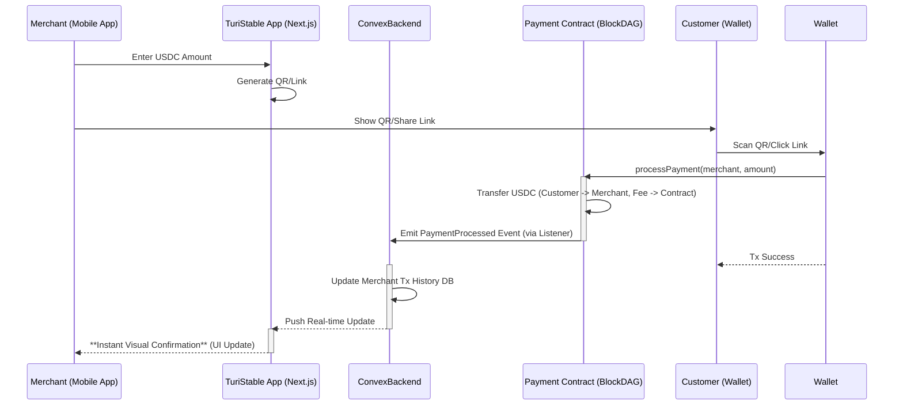

# 🌎 **TuriStable Protocol: Unified Payments for Panama's Tourism**

## Executive Summary

Panama's tourism SMEs face significant operational hurdles due to **fragmented
payment data**. Juggling cash, high-fee international cards, local apps, and
potentially crypto creates bookkeeping nightmares and hinders growth.
**TuriStable Protocol** addresses this with a **two-pronged approach**:

1. **MVP (Hackathon Scope):** A simple, mobile-first Point-of-Sale (POS) web
   application enabling SMEs to **accept international USD Coin (USDC)
   payments** via a low-fee BlockDAG network. This provides instant settlement,
   drastically reduced fees (1.8%), and a verifiable transaction history for
   USDC.
2. **Strategic Vision:** A **Unified Payment Dashboard** that integrates
   TuriStable's real-time crypto data with traditional payment streams
   (potentially via future integrations like Lemon Squeezy) into a single
   interface, offering comprehensive financial oversight and simplifying
   reconciliation for SMEs, ultimately strengthening the local tourism
   ecosystem.

This README focuses on the **achievable 5-day MVP** – the foundational step
towards realizing this vision, spotlighting its immediate benefits, local
impact, and core "hero feature."

---

## The Problem: Fragmented Payments & Bookkeeping Chaos for Panama SMEs

Panama's tourism businesses operate in a dollarized economy but struggle with a
messy payment landscape when dealing with international tourists:

- **High Card Fees:** International cards carry hefty fees (often 5-7%), slow
  settlement times, and higher decline rates, directly impacting profitability.
- **Cash Limitations:** Cash is insecure, offers no digital trail for financing,
  and isn't suitable for advance online bookings.
- **Local App Gaps:** Solutions like Cuanto.app work well domestically but fail
  for international or stablecoin payments.
- **Crypto Complexity (Current State):** While crypto offers potential, existing
  solutions can be complex, volatile, or lack trust.
- **The Core Pain Point: Data Fragmentation:** Most critically, income arrives
  through disconnected channels (card processor statements, bank transfers, cash
  logs, separate crypto wallets). Reconciling these disparate data streams is a
  manual, time-consuming, and error-prone process, making accurate financial
  oversight incredibly difficult for busy SMEs.

This fragmentation prevents businesses from getting a clear, real-time picture
of their finances, complicates bookkeeping, hinders access to credit, and makes
it harder to make informed business decisions that benefit the local economy.

---

## The Solution: TuriStable Protocol - From MVP POS to Unified Vision

TuriStable Protocol tackles payment fragmentation head-on, starting with a
streamlined crypto payment solution designed for immediate value and building
towards a holistic dashboard that empowers local businesses.

**MVP Foundation: The Mobile USDC POS App**

The hackathon MVP delivers a **standalone, mobile-first web application** that
acts as a simple POS for accepting **USD Coin (USDC)** payments. Key features
include:

- **Effortless USDC Acceptance:** Generate QR codes (in-person) or payment links
  (remote) directly from a smartphone or tablet.
- **Drastically Lower Fees:** A transparent 1.8% protocol fee on successful USDC
  transactions, compared to 5-7% for international cards.
- **Near-Instant Settlement:** Leverage BlockDAG speeds for faster access to
  funds compared to multi-day card settlements.
- **Verifiable History:** All USDC transactions are recorded on-chain and
  displayed in the app's dashboard, providing an immutable record exportable via
  CSV.
- **Built on Trust:** Uses USDC, a fully-backed, regulated stablecoin, ideal for
  Panama's dollarized market.

 _(Placeholder for App UI
Screenshot)_

### Local Community Impact

Beyond individual business benefits, TuriStable Protocol is designed to uplift
the broader Panamanian tourism ecosystem:

- **Empowering Grassroots SMEs:** Lower fees (saving ~$3.20 per $100 vs. cards)
  allow small businesses like tour operators, artisans, and family-run hotels to
  retain more revenue for reinvestment in local hiring, supplies, and services.
- **Unlocking Micro-Finance:** The immutable, verifiable transaction history
  generated by the protocol can serve as crucial documentation for SMEs seeking
  micro-loans or traditional financing, fostering business growth.
- **Seeding a Community Fund:** A portion of the 1.8% protocol fee is
  automatically allocated to a dedicated fund, envisioned as a future
  DAO-governed treasury to support local tourism development projects chosen by
  the SMEs themselves.
- **Enhancing Visitor Experience:** Offering tourists a secure, low-fee digital
  payment option (USDC now, cards via future integrations) improves convenience
  and builds trust.
- **Strengthening Economic Resilience:** Faster settlement improves cash flow
  for SMEs, helping them better manage operational costs and mitigate the risks
  associated with seasonal tourism fluctuations.

**Micro-Case Studies (Illustrative):**

- _A Bocas del Toro mangrove tour operator uses fee savings from accepting USDC
  via TuriStable to hire an additional local guide during peak season._
- _An artisan collective in Casco Viejo leverages their TuriStable verifiable
  transaction history to successfully apply for a micro-loan to purchase better
  materials._
- _A boutique hotel near Boquete streamlines its international deposit process,
  improving cash flow and allowing investment in locally sourced guest
  amenities._

**The Strategic Vision: Unified Payment Dashboard**

The MVP's USDC transaction data forms the first pillar of our long-term vision:
a **Unified Payment Dashboard**. This future platform aims to:

- **Integrate Multiple Streams:** Combine TuriStable's real-time USDC data with
  data from traditional payment processors (potentially via integrations like
  **Lemon Squeezy** for card payments) and allow manual entry for cash.
- **Simplify Bookkeeping:** Provide a single source of truth for all income
  streams, dramatically reducing reconciliation time and errors.
- **Offer Customer Choice:** Allow SMEs to confidently offer multiple payment
  options (USDC, cards, etc.) knowing the data will converge seamlessly in their
  dashboard.
- **Unlock Insights:** Enable better financial reporting and analysis based on
  comprehensive payment data.

The MVP focuses on perfecting the USDC acceptance and data capture piece –
proving the value of low-fee, instant crypto payments and building the
foundational data layer for this unified future that benefits the entire local
tourism value chain.

---

## MVP Hero Feature Spotlight: Instant Visual Confirmation

The **standout capability of our 5-day MVP** is the **instant visual
confirmation of successful USDC payments directly within the merchant's mobile
app**. When a tourist pays using the generated QR code or link, the TuriStable
backend (powered by **Convex**) listens for the on-chain `PaymentProcessed`
event. As soon as the BlockDAG confirms the transaction (typically 2-5 seconds),
the merchant's dashboard UI updates **in real-time**, showing the new
transaction and updated balance. This isn't just a notification; it's a live
update mirroring the on-chain reality. For the hackathon demo, this feature
disruptively showcases:

1. **Tangible Speed:** Demonstrates the near-instant settlement advantage over
   slow traditional systems.
2. **Enhanced Trust:** Provides immediate, undeniable proof of payment for both
   merchant and customer, crucial in face-to-face interactions.
3. **Foundation for Unity:** Proves our ability to capture and display real-time
   blockchain data, the core requirement for integrating crypto into the future
   Unified Payment Dashboard.

---

## Hackathon MVP Scope & 5-Day Plan

This lean MVP is achievable within 5 days:

- **Core Functionality:**
  - Merchant registration/login (via Convex auth).
  - Mobile-first web app (Next.js) to generate USDC payment QR codes/links.
  - BlockDAG Smart Contract (`TuriStableMVP`) for processing USDC payments
    (transfer, 1.8% fee).
  - **Convex backend** to listen for `PaymentProcessed` events and update
    merchant history in real-time.
  - App dashboard displaying transaction history **with instant visual
    confirmation**.
  - CSV export of USDC transaction history.
  - **Indicative** USD/PAB price display alongside USDC amounts (via centralized
    API).
- **Exclusions (Future Work):** Direct fiat integration, **Lemon Squeezy
  integration (card payments)**, advanced community fund governance (DAO setup),
  automated reconciliation, direct off-ramping features.

**5-Day Plan:**

1. **Day 1: Foundation:** Setup Turborepo, Next.js app, Convex backend, Foundry
   project. Define core data models (USDC focus).
2. **Day 2: Contract Logic:** Implement & test `TuriStableMVP` contract (USDC
   transfer, fee, event).
3. **Day 3: Backend Integration:** Deploy contract. Setup Convex functions
   (merchant verification, event listener, **real-time DB updates**).
4. **Day 4: Frontend MVP:** Build POS interface (generate QR/link), transaction
   history display **with real-time updates & indicative fiat price**.
5. **Day 5: E2E Flow & Polish:** Connect frontend to wallet, test full POS flow
   (Generate -> Pay -> **See Instant Confirmation**), styling, demo prep.

---

## Architecture Overview

The MVP uses a simple, robust architecture:

- **Frontend:** Mobile-first Next.js web application.
- **Backend:** Convex for real-time database, authentication, and serverless
  functions (listening to blockchain events).
- **Blockchain:** EVM-compatible BlockDAG network hosting the `TuriStableMVP`
  Solidity contract for USDC payments.

---

## Key Metrics & Savings

TuriStable Protocol offers quantifiable advantages:

- **Reduced Fees:**
  - Traditional International Card Fee (Example): **~5.0%**
  - TuriStable Protocol Fee: **1.8%**
  - **Savings Example:** On a $100 USDC sale, a merchant saves **$3.20**
    ($5.00 - $1.80) compared to typical card fees.
- **Transaction Speed (BlockDAG Estimates):**
  - Latency: **~2-5 seconds** for transaction finality.
  - Gas Cost: **~0.0005 USDC** per transaction (significantly lower than many
    L1s).
- **Settlement Time:** Near-instant vs. 2-3 business days for card payments.

---

## User Experience (MVP)

The MVP prioritizes simplicity for merchants:

- **Mobile POS Flow:**
  1. Open App, Log In.
  2. Enter amount **in USDC**.
  3. Generate QR/Link.
  4. Present to Tourist.
  5. **Receive Instant Visual Confirmation** in the app.
- **Indicative Fiat Display:** To aid merchants unfamiliar with USDC, the app
  fetches an **approximate** USD/PAB equivalent price from a reliable
  centralized API (e.g., CoinGecko) and displays it next to the USDC amount.
  This is clearly labeled as **indicative only** and enhances usability without
  introducing the complexities or potential unreliability of on-chain oracles in
  the MVP.
- **Simple History & Export:** Easily view past USDC transactions and export
  data as CSV for use in existing accounting tools.

 _(Placeholder for
Dashboard UI Screenshot)_

---

## Future Roadmap

The hackathon MVP is the first step. Our future roadmap focuses on realizing the
Unified Payment Dashboard vision and deepening community impact:

1. **Unified Dashboard Development:** Integrate traditional payment processors
   (e.g., exploring **Lemon Squeezy** API) to combine card/bank data with
   TuriStable's crypto data. Allow manual cash entry for a truly holistic view.
2. **Panama Tourism Community Fund (DAO):** Formally establish the community
   fund as a DAO, governed by verified Panamanian tourism SMEs registered on the
   platform, to transparently allocate collected protocol fees towards local
   development initiatives.
3. **Off-Ramping Solutions:** Partner with local exchanges or P2P platforms to
   facilitate easy USDC-to-fiat (USD/PAB) conversion for merchants.
4. **Enhanced Features:** Multilingual support (Spanish/English), advanced
   analytics within the unified dashboard, customizable payment pages, and
   potentially deeper booking platform integrations based on SME feedback.

---

**(Note: Detailed smart contract code, security considerations, and setup
instructions can be found in the full technical documentation / appendix.)**
