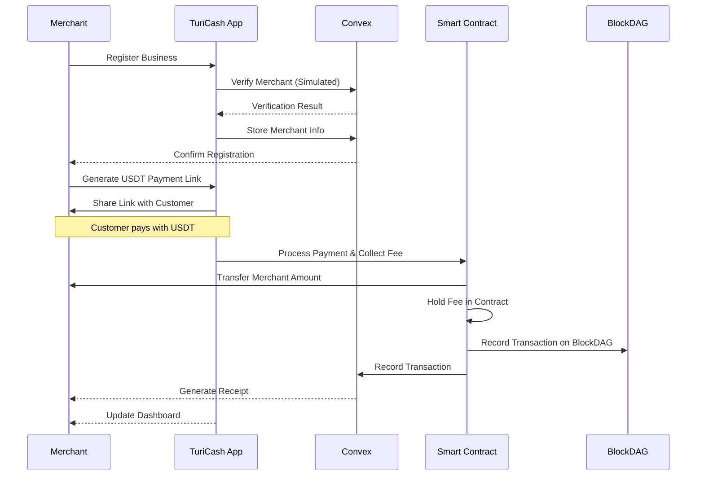
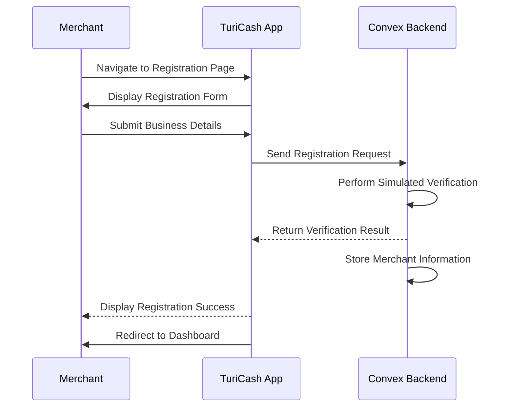
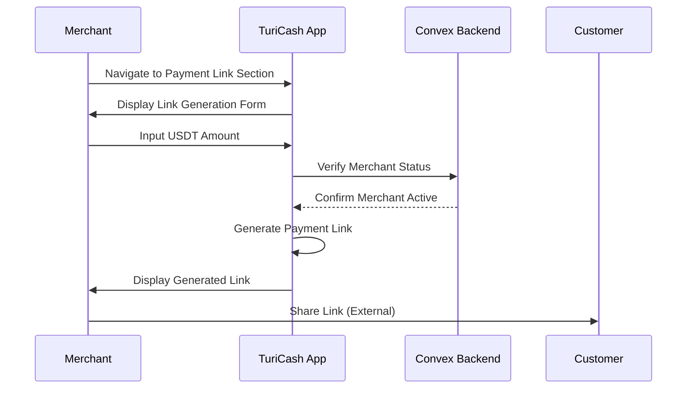
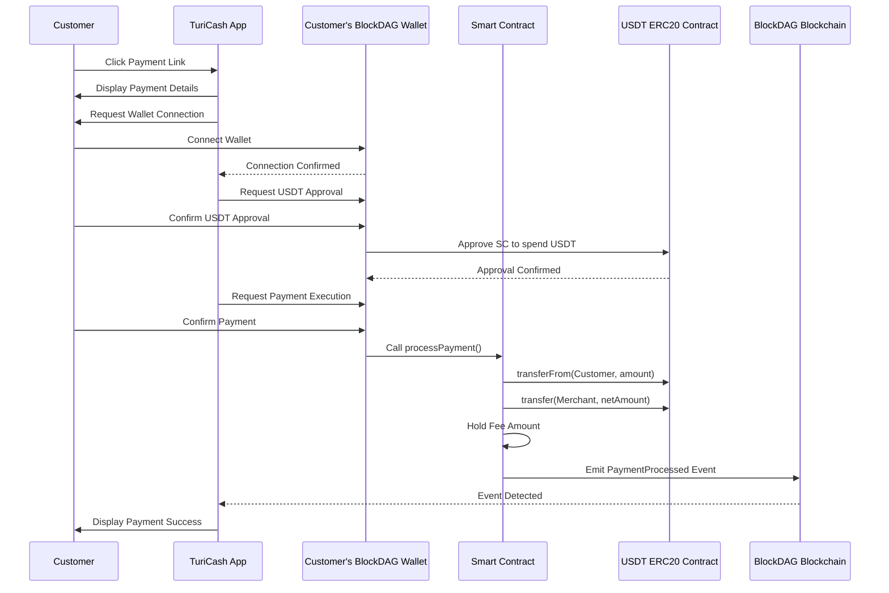
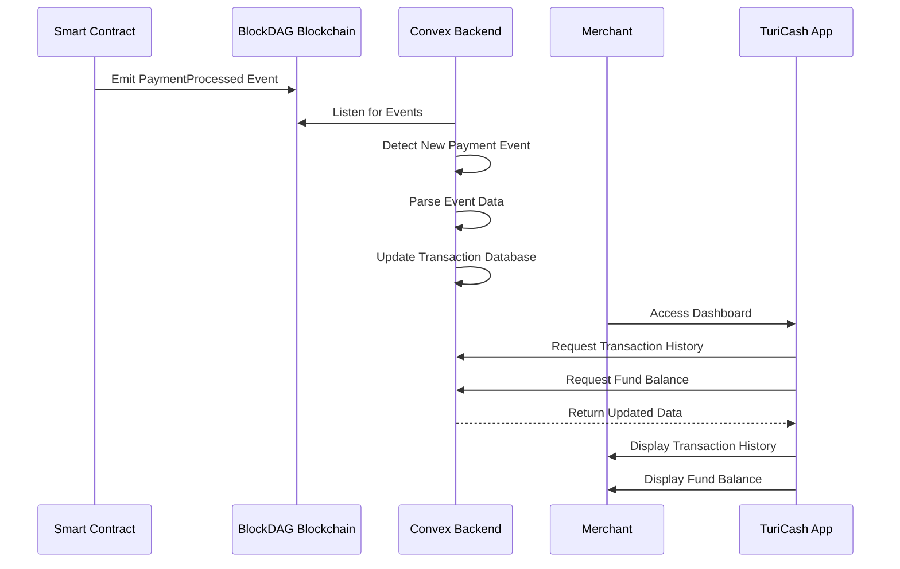

# 🌎 **TuriCash DAO: Empowering Panama's Tourism Communities**

## 📌 Summary

**TuriCash DAO** is a payment platform designed specifically for Panama's
tourism communities. We transform how local tourism businesses handle payments
by enabling them to accept stablecoin payments from international tourists,
creating verifiable financial records, and building a community fund for local
tourism development.

For the ETH Canal hackathon, we're focusing on a minimal viable product that
demonstrates our core value proposition: enabling Panamanian tourism businesses
to accept international payments via USDT on BlockDAG, overcoming traditional
cross-border payment barriers.

---

## 🎯 Why Panama's Tourism Communities Need TuriCash

### The International Payment Challenge in Panama

While Panama's tourism sector grows rapidly with over 2 million international
visitors annually, local businesses face a critical gap between local and
international payment capabilities:

- **Tour Guides in Bocas del Toro:** While local payments via solutions like
  Cuanto.app work well, accepting advance payments from international tourists
  remains challenging. Traditional card processors often reject international
  transactions or charge exorbitant fees (5-7%).
- **Artisans in Casco Viejo:** Local digital payment solutions serve domestic
  customers, but international tourists face high foreign transaction fees and
  currency conversion costs when using cards.
- **Small Hotels in Boquete:** While local payment links work for domestic
  bookings, international guests often cancel when faced with high international
  card processing fees or complex bank transfer requirements.
- **Restaurants in Panama City:** Local payment solutions don't address the core
  challenge of accepting international payments efficiently, leaving businesses
  to rely on cash from tourists who carry it.

### The Payment Infrastructure Gap

Panama's tourism businesses operate in a bifurcated payment environment:

- **Local vs International:** While local payment solutions (like Cuanto.app)
  have improved domestic transactions, they don't solve the specific challenges
  of international payments:
  - High international card processing fees (5-7% vs 1.8% with TuriCash)
  - Complex cross-border bank transfer requirements
  - Limited access to international payment networks
  - Currency conversion costs and delays

- **Lost International Opportunities:** The inability to accept international
  payments efficiently leads to:
  - Missed advance bookings from international tourists
  - Reduced competitiveness against larger hotels with international payment
    capabilities
  - Limited access to international tourism platforms
  - Cash dependency for international transactions

- **Verification Challenges:** Without proper international payment records:
  - No verifiable income history for international transactions
  - Difficulty proving international business activity to lenders
  - Limited ability to scale international tourism operations
  - Missing data for international market analysis

### The Cash Management Problem

Tourism businesses in Panama operate in a cash-heavy environment, creating
significant challenges:

- **Lost Opportunities:** No digital records mean no access to business loans.
  Traditional lenders require 2-3 years of bank statements, which cash-only
  businesses can't provide.
- **Limited Growth:** Can't prove income for expansion or partnerships with
  larger tourism operators.
- **Operational Inefficiency:** Manual cash tracking consumes valuable time that
  could be spent on business development.
- **Market Visibility:** Stay invisible to digital tourism platforms that
  require integrated payment solutions.

---

## 💡 The TuriCash Solution (Hackathon MVP)

For the ETH Canal hackathon, we're focusing on a minimal viable product that
demonstrates our core value proposition: enabling Panamanian tourism businesses
to accept international payments via USDT on BlockDAG, overcoming traditional
cross-border payment barriers.

### 1. International USDT Payment Acceptance

- **Global Payment Access:** Direct USDT acceptance from any international
  tourist with a crypto wallet
- **Lower Fees:** 1.8% transaction fee vs 5-7% for international card processing
- **No Cross-Border Complexity:** Eliminates traditional international payment
  hurdles:
  - No international card processing requirements
  - No complex bank transfer setups
  - No currency conversion delays
  - No international payment network dependencies
- Simple merchant registration with basic verification
- One-click payment link generation for international customers
- Atomic transaction recording on BlockDAG

### 2. Verifiable International Financial History

- On-chain transaction recording on BlockDAG
- Basic dashboard with international transaction tracking
- Exportable records for international business activity
- Transparent history for international tourism platforms

### 3. Community Fund

- 1.8% transaction fee handling (significantly lower than international card
  processing)
- Basic fund balance tracking
- Secure atomic fee collection via smart contract
- Transparent fee distribution and tracking

### 4. Future Vision: Community Development Program

> _Note: The following features are planned for post-hackathon development, not
> part of the 5-day MVP._

- **Local Tourism Development**
  - Infrastructure improvements for tourism areas
  - Training and education programs for local businesses
  - Marketing support for small tourism operators
  - Sustainable tourism initiatives

- **Fund Allocation**
  - Community-driven proposal system
  - Transparent voting mechanism for fund usage
  - Priority for local development projects
  - Support for small business growth initiatives

- **Governance Structure**
  - Local business representation in decision-making
  - Community-driven fund management
  - Regular reporting and accountability
  - Measurable impact tracking

### User Experience Flow (MVP)



### Detailed System Flows

#### 1. Merchant Registration Flow



#### 2. Payment Link Generation Flow



#### 3. Customer Payment Processing Flow



#### 4. Backend Update & Merchant Dashboard Flow



---

## 📦 Hackathon MVP Scope (5 Days)

### Day 1: Foundation

- Set up project structure
- Implement basic merchant registration
- Create simple UI for merchant dashboard
- Focus on Turborepo structure and Convex project setup

### Day 2: Core Backend & Link Generation

- Implement Convex mutations for merchant registration
- Create payment link generation system
- Set up basic transaction recording
- Implement frontend logic for payment flow

### Day 3: Smart Contract & BlockDAG Integration

- Deploy core payment processing contract on BlockDAG
- Connect frontend to smart contract
- Implement USDT approval and payment flow
- Test transaction processing on BlockDAG testnet

### Day 4: Dashboard & Event Processing

- Set up Convex event listeners for payments
- Build transaction history view
- Implement community fund display
- Create merchant analytics dashboard

### Day 5: Testing & Refinement

- End-to-end testing
- Bug fixes and refinements
- Prepare demo presentation
- Document next steps and future enhancements

---

## 🔄 Price Feed Implementation Roadmap

Our approach to price feeds balances immediate MVP needs with long-term
decentralization goals:

### Phase 1: MVP (Days 1-5)

- **Simple 1:1 USDT/USD Display**
  - Assume USDT/USD parity for UI display
  - Clear UI indicators showing "Demo Mode" pricing
  - No price feed dependency for core payment functionality
  - Focus on demonstrating core payment flow

### Phase 2: Centralized Backend (Week 1-2)

- **Convex Price Service**
  ```typescript
  // convex/price.ts
  export const getUSDTPrice = async () => {
    const response = await fetch(
      "https://api.coingecko.com/api/v3/simple/price?ids=tether&vs_currencies=usd",
    );
    const data = await response.json();
    return data.tether.usd;
  };
  ```
- Cached price updates (5-minute intervals)
- Fallback mechanisms for API failures
- Transparent price source attribution
- Historical price tracking for analytics

### Phase 3: Hybrid Oracle (Week 3-4)

- **Multi-Source Price Aggregation**
  - Chainlink Price Feeds on Arbitrum (primary)
  - CoinGecko API (secondary)
  - On-chain price validation
  - Automated source switching based on reliability
  ```solidity
  // contracts/PriceOracle.sol
  contract PriceOracle {
      struct PriceData {
          uint256 price;
          uint256 timestamp;
          string source;
      }
      
      mapping(address => PriceData[]) public priceHistory;
      
      function updatePrice(uint256 _price, string memory _source) external {
          // Store price with source attribution
      }
  }
  ```

### Phase 4: Full Decentralization (Month 2+)

- **Chainlink Integration on BlockDAG**
  - Direct Chainlink Price Feeds when available
  - Cross-chain price verification
  - Decentralized price aggregation
  - Community-governed price source selection
  ```solidity
  // Future: contracts/DecentralizedOracle.sol
  contract DecentralizedOracle {
      // Chainlink integration
      // Community governance
      // Cross-chain verification
  }
  ```

### Decentralization Considerations

- **MVP Phase**: Focus on core payment functionality
- **Short-term**: Centralized price service with transparency
- **Medium-term**: Hybrid approach with multiple sources
- **Long-term**: Full Chainlink integration on BlockDAG

### Security Measures

- Price deviation monitoring
- Automated alerts for anomalies
- Fallback mechanisms at each phase
- Clear documentation of current phase

---

## 🔒 Decentralization Value Proposition

TuriCash DAO offers several distinct decentralization benefits compared to
traditional fintech solutions:

### 1. Permissionless Access to Global Payments

- Any Panamanian merchant with an internet connection and a crypto wallet can
  register
- No approval from traditional banks or complex cross-border setup requirements
- Transactions are peer-to-peer (customer wallet to merchant/contract)

### 2. Immutable & Verifiable Transaction Records

- Tamper-proof, publicly verifiable ledger of payment activity on BlockDAG
- Provable financial history that merchants can leverage for loans or
  partnerships
- Blockchain immutability ensures records cannot be altered or deleted

### 3. Transparent & Secure Community Fund Holding

- 1.8% fee collected atomically during payment processing
- Smart contract automatically deducts and holds fees
- Funds are secured by reentrancy protection and access controls
- Transparent on-chain tracking of all fees collected
- Only authorized owner can withdraw fees (MVP phase)
- Complete audit trail of fee collection and distribution

### 4. Reduced Platform Risk (at Core Layers)

- Core payment rails (USDT on BlockDAG) and record-keeping ledger are
  decentralized
- Atomic transactions ensure fees are always collected
- If the TuriCash frontend/backend went offline, the underlying payment
  capability and historical record persist
- Merchants aren't solely reliant on TuriCash's servers for core value transfer
  and record integrity

---

## 👥 Panama-Specific Use Cases

| User Type   | Location       | Key Benefit                                                         |
| ----------- | -------------- | ------------------------------------------------------------------- |
| Tour Guide  | Bocas del Toro | Accept advance USDT payments from international tourists            |
| Artisan     | Casco Viejo    | Receive digital payments from tourists who prefer not to carry cash |
| Small Hotel | Boquete        | Build verifiable financial history for future loans                 |
| Restaurant  | Panama City    | Participate in community fund for local tourism development         |

---

## 🌐 Final Pitch

> **TuriCash DAO transforms international payments into local growth for
> Panama's tourism communities.**\
> By enabling seamless USDT payments from global tourists and creating
> verifiable international transaction records, we help local tourism businesses
> overcome cross-border payment barriers that traditional solutions and local
> fintechs can't address.

Unlike local payment solutions that focus on domestic transactions, TuriCash DAO
specifically targets the international payment challenges faced by Panama's
tourism businesses. Our Web3-powered platform offers:

- **Global Payment Access:** Direct USDT acceptance from any international
  tourist
- **Lower Fees:** 1.8% vs 5-7% for international card processing
- **Verifiable International History:** On-chain records of international
  transactions
- **Community Development:** Transparent fee collection for local tourism growth

Join us in building the future of Panama's international tourism with TuriCash
DAO. Our hackathon MVP demonstrates how Web3 can solve real cross-border payment
challenges that traditional fintech solutions can't address.

---

## 🔧 Technical Setup

### Prerequisites

```bash
# Required tools
node >= 18.0.0
pnpm >= 8.0.0
```

### Environment Setup

```bash
# Clone repository
git clone https://github.com/your-org/turicash-dao.git
cd turicash-dao

# Install dependencies
pnpm install

# Set up environment variables
cp .env.example .env
```

### Project Structure

```bash
turicash-dao/
├── apps/
│   ├── web/                 # Next.js frontend
│   └── api/                 # Convex backend
├── packages/
│   ├── contracts/           # Solidity smart contracts
│   ├── shared/              # Shared utilities and types
│   └── ui/                  # Shared UI components
```

### Environment Variables

```bash
# .env
# Blockchain
BLOCKDAG_RPC_URL=https://testnet.blockdag.com/rpc

# Convex
NEXT_PUBLIC_CONVEX_URL=your_convex_url
CONVEX_DEPLOY_KEY=your_deploy_key
```

---

## 🔒 Smart Contract Implementation

The core payment processing is handled by a secure, atomic smart contract:

```solidity
// SPDX-License-Identifier: MIT
pragma solidity ^0.8.20;

import "@openzeppelin/contracts/token/ERC20/IERC20.sol";
import "@openzeppelin/contracts/security/ReentrancyGuard.sol";
import "@openzeppelin/contracts/access/Ownable.sol";

contract TuriCashMVP is ReentrancyGuard, Ownable {
    IERC20 public immutable usdt;
    uint256 public constant FEE_BPS = 180; // 1.8% (180 / 10000)
    mapping(address => bool) public isVerifiedMerchant;

    event PaymentProcessed(
        address indexed merchant,
        address indexed customer,
        uint256 amountPaid,
        uint256 feeCollected,
        uint256 merchantAmount,
        uint256 timestamp
    );

    constructor(address _usdtAddress, address initialOwner) Ownable(initialOwner) {
        usdt = IERC20(_usdtAddress);
    }

    function processPayment(address merchant, uint256 amount) external nonReentrant {
        require(isVerifiedMerchant[merchant], "Merchant not verified");
        require(amount > 0, "Amount must be positive");

        uint256 fee = (amount * FEE_BPS) / 10000;
        uint256 merchantAmount = amount - fee;

        usdt.transferFrom(msg.sender, address(this), amount);
        usdt.transfer(merchant, merchantAmount);

        emit PaymentProcessed(
            merchant,
            msg.sender,
            amount,
            fee,
            merchantAmount,
            block.timestamp
        );
    }

    function withdrawFees(address recipient, uint256 amount) external onlyOwner {
        require(amount <= usdt.balanceOf(address(this)), "Insufficient fee balance");
        usdt.transfer(recipient, amount);
    }

    function setMerchantVerification(address merchant, bool status) external onlyOwner {
        isVerifiedMerchant[merchant] = status;
    }
}
```

Key security features:

- Reentrancy protection
- Atomic transactions
- Access control for fee withdrawal
- Merchant verification system
- Event-based transaction tracking

---

## 🔍 Project Evaluation

### 1. Hackathon Scope Assessment

- **Well-structured for 5-day delivery**
  - Focused core loop: Register → Generate Link → Process USDT Payment → Record
    → Display
  - Minimal smart contract with clear functionality
  - Clear day-by-day implementation plan

### 2. Minimal yet Decentralized

- **Core Features**
  - USDT payment processing
  - Basic transaction records
  - Community fund tracking
  - No complex governance or multi-currency

- **Decentralized Components**
  - Permissionless value transfer via USDT on BlockDAG
  - Immutable transaction records
  - Transparent fee collection
  - On-chain core logic

### 3. Problem-Solution Fit

- **Core Pain Points Addressed**
  - Digital payment acceptance for cash-based businesses
  - Verifiable financial history for loans/investments
  - Operational efficiency through automation
  - Community fund for local development

### 4. ETH Canal & Panama Relevance

- **Blockchain Integration**
  - Smart contracts on BlockDAG
  - USDT for USD-based economy
  - Financial inclusion focus
  - Community fund for tourism development

### 5. Implementation Priorities

1. **Core Infrastructure**
   - Turborepo setup
   - Convex backend
   - Next.js frontend

2. **Payment Processing**
   - Smart contract deployment on BlockDAG
   - USDT integration
   - Fee collection mechanism

3. **User Experience**
   - Merchant registration
   - Payment link generation
   - Transaction dashboard
   - Community fund display
