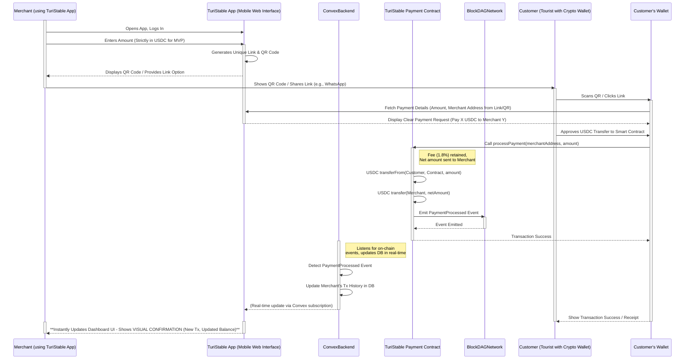

# 🌎 **TuriStable Protocol: Borderless Payments for Panama's Tourism**

## To-dos

- [x] Setup pnpm Turborepo
- [x] Init Convex Next.js
- [ ] Practice with a demo Fund Me project
- [ ] Integrate Foundry with Turborepo (for BlockDAG smart contract development)
- [ ] Implement Core Payment Contract MVP
- [ ] Setup Wagmi
- [ ] Add BlockDAG Primordial Testnet to Wagmi (Viem)
- [ ] Basic Merchant Dashboard UI
- [ ] Integrate Lemon Squeezy API into the dashboard?

## 📌 Summary

**TuriStable Protocol** provides Panama's tourism SMEs with a **simple,
mobile-first web application acting as a smart-contract-enabled Point-of-Sale
(POS) tool**. It allows businesses to seamlessly **manage international USD Coin
(USDC) payments at a fraction of traditional costs**. Leveraging USDC, a
globally recognized stablecoin known for its **transparency and full backing**,
our platform empowers businesses to confidently accept payments from
international tourists using just their smartphone or tablet. Secure, automated
on-chain settlement eliminates the high fees and integration hassles of outdated
systems. The free dashboard provides a **verifiable transaction history**,
enabling **effortless bookkeeping** alongside your existing fiat records using
tools you already know.

Our ETH Canal MVP demonstrates this core value: a simple, free **standalone POS
web app** allowing Panamanian tourism SMEs to generate payment links/QR codes,
track incoming USDC payments processed via a low-fee BlockDAG smart contract,
and export transaction data—making **stablecoin** payments accessible,
trustworthy, and profitable.

---

## 💸 Lean Treasury Management & UX (MVP)

Our MVP approaches treasury management with a focus on **simplicity, control,
and integration with existing workflows**, providing an excellent UX for tourism
SMEs new to crypto:

1. **Direct Merchant Control (Crypto):**
   - **How it works:** Businesses receive USDC directly into their **own
     self-custody crypto wallets** (e.g., MetaMask, Trust Wallet). **TuriStable
     Protocol** _never_ holds merchant funds.
   - **UX Advantage:** This provides maximum **security and control** to the
     merchant, eliminating platform risk and aligning with crypto best
     practices. It keeps the **TuriStable** interface simple, focused only on
     facilitating payments.

2. **Clear Crypto Income Tracking:**
   - **How it works:** The **TuriStable** dashboard provides a **real-time,
     clear history** of all USDC payments received through the protocol,
     including amounts, timestamps, and optional references (like booking IDs).
   - **UX Advantage:** Merchants can instantly see their **USDC** income stream
     without needing to manually check their wallet or block explorers.

3. **Flexible Fiat Reconciliation (Manual via CSV):**
   - **How it works:** The dashboard allows merchants to **export their crypto
     transaction history as a standard CSV file.**
   - **UX Advantage:** This empowers businesses to use **tools they already
     know** (Excel, Google Sheets, accounting software) to track crypto
     alongside their existing fiat records. It avoids forcing users into a
     complex, unfamiliar integrated system and provides maximum **flexibility
     for their specific accounting needs.**

**What the MVP Does NOT Include:**

- **Direct Fiat Management:** The protocol does not connect to bank accounts or
  manage fiat currency.
- **Automated Reconciliation:** Syncing crypto transactions with fiat bank
  statements is a manual process using the CSV export.
- **Built-in Off-Ramping:** Converting USDC to fiat is handled outside the
  protocol (see Post-Hackathon Focus).

By keeping the MVP lean and focused, we provide a non-intimidating entry point
into **stablecoin** payments, giving businesses full control over their funds
and the flexibility to integrate crypto tracking into their existing financial
workflows.

---

## 🎯 Why Panama's Tourism SMEs Are Underserved

### The Crippling Cost of International Payments

Panama's vibrant tourism sector attracts millions of international visitors.
Yet, the local SMEs who form the backbone of this industry – hotels, guides,
artisans – struggle with outdated and costly international payment methods:

- **Local Payment Apps (e.g., Cuanto.app):** Great for domestic payments, but
  fail when tourists need to pay _in advance_ or settle internationally,
  especially with **stablecoins**.
- **Exorbitant Card Fees:** International cards often incur **5-7% fees**, plus
  higher rejection rates and multi-day settlement delays, directly eroding SME
  profit margins.
- **Slow & Costly Bank Transfers:** International wire transfers are impractical
  for typical tourism transaction sizes due to complexity and high fees.
- **Cash Limitations:** Reliance on cash blocks advance bookings, creates
  security risks, and leaves **no digital footprint** for business growth
  (loans, partnerships).

This friction translates directly to **lost bookings, reduced competitiveness,
operational headaches, and stunted growth**. The lack of a trusted, efficient,
and affordable way to accept digital USD from international clients is a major
pain point in Panama's dollarized economy.

### The TuriStable Protocol Advantage: Boost Profits, Simplify Operations

**TuriStable Protocol** cuts through the complexity and cost, offering a
powerful, business-friendly alternative centered on **USD Coin (USDC)**:

- **Unlock Global USDC Payments via Simple Mobile POS:** Seamlessly accept
  **USDC** from international tourists using simple payment links or QR codes
  generated from your **free, mobile-first web app**. Leverage a globally
  recognized stablecoin ideal for cross-border transactions.
- **Build on Trust & Stability:** Accept payments using **USDC**, known for
  being **fully backed by reserved assets** and issued by regulated financial
  institutions. This provides crucial **peace of mind** for businesses and
  customers in Panama's dollarized market.
- **Slash Fees Dramatically:** Our lean protocol ensures a minimal 1.8% fee
  **only on successful USDC payments**, a fraction of the 5-7% international
  card rates, directly **boosting your bottom line**.
- **Get Paid Instantly:** Near-instant settlement means **USDC** funds appear
  quickly, visible in your dashboard, improving cash flow.
- **Simplify Bookkeeping—For Free:** The dashboard provides an immutable, **free
  exportable history** (CSV) of all **USDC** transactions, making reconciliation
  with your existing fiat records straightforward using tools you already own.
  **Think of it as your digital USDC cash register tape.**
- **Effortless Stablecoin POS:** Our user-friendly dashboard makes payment
  creation and tracking intuitive, even if you're new to crypto. **No costly
  training or complex hardware needed.**
- **Future-Proof Foundation:** Choosing **USDC** lays the groundwork for
  potential future enhancements leveraging its established ecosystem,
  potentially offering easier cross-chain compatibility or streamlined SME
  onboarding tools down the line.

### The "Why Now?" Opportunity: Timing is Everything

Launching a lean, effective solution is feasible _now_ because:

1. **Stablecoins are Globally Adopted:** **USDC** is widely accessible,
   understood, and increasingly used for international transactions.
2. **Next-Gen Infrastructure:** BlockDAG technology _potentially_ offers the
   speed and low cost needed for high-volume, small-value tourism payments.
3. **Rapid Development Tools:** Modern frameworks (Next.js, Convex) allow a
   small, agile team to build and deploy the core infrastructure quickly.

---

## 💵 Risk-Free Adoption: Free Tools, Pay-Only-for-Value

We believe adopting new payment methods shouldn't be costly or complicated.
**TuriStable Protocol** is designed to be a **no-brainer** for your business to
start accepting **USDC**:

- **Use Your Existing Tools—For Free:** Our dashboard and CSV export features
  are **completely free**. Integrate your **USDC** payment records with Excel,
  Google Sheets, QuickBooks, or any tool you already use, **at no extra cost.**
  No integration fees, ever.
- **Only Pay When You Get Paid:** The _only_ charge is a small, transparent
  protocol fee (e.g., 1.8%) automatically applied **only when you successfully
  receive a USDC payment** via the smart contract. No subscriptions, no setup
  fees, no hidden costs.
- **Zero Lock-In:** You're never forced into a closed system. Keep using the
  business tools you love, and benefit from low-cost, secure **USDC** payments.

**This makes TuriStable Protocol the most accessible, cost-effective, and
flexible way for your tourism business to start accepting global USDC payments
today.**

---

## 💡 The TuriStable Protocol Solution: Core Infrastructure MVP

Our ETH Canal MVP delivers the essential **low-fee smart contract settlement
layer** paired with a **free, functional mobile-first web app** that acts as a
simple **Point-of-Sale (POS)** tool to manage **USDC** payments and simplify
bookkeeping.

### 1. Seamless International USDC Acceptance via Mobile POS App

- **Purpose-Built for USDC:** Operates on an EVM-compatible BlockDAG network,
  powering the web app's backend for **USDC** transactions.
- **Effortless Payment Requests:** Generate simple payment links/QR codes for
  **USDC** directly from the app on your phone or tablet.
- **Low, Transparent Fee:** A minimal 1.8% protocol fee, handled atomically by
  the smart contract and clearly displayed.
- **Eliminate Traditional Friction:** Bypass costly card networks and slow banks
  for payment _acceptance_.
- **Simplified Merchant Onboarding:** Fast registration process to access the
  app.

### 2. Free Dashboard for Verifiable History & Bookkeeping

- **Tamper-Proof Ledger:** Smart contract events feed the **free dashboard
  within the app**, ensuring an immutable transaction record.
- **Accessible Records:** The app displays a clear history of **USDC** payments
  at **no cost**.
- **Foundation for Bookkeeping:** **Free exportable CSV data** allows easy
  integration of **USDC** transactions into existing fiat accounting workflows
  using your preferred tools.

### 3. Foundational Community Fund Mechanism

- **Protocol Fee:** 1.8% fee automatically collected by the smart contract
  during payment.
- **Secure Holding:** Fees held in the contract, withdrawable only by the
  contract owner (MVP scope).
- **Transparency:** Fee collection is visible on-chain.
  - _Future Vision:_ Post-hackathon, explore decentralized governance models for
    fund allocation towards local tourism development, truly realizing the
    "community" aspect once the core protocol is stable and adopted. This aligns
    with the "Protocol" focus first.

### 4. Addressing the Off-Ramp Challenge (Post-Hackathon Focus)

We recognize that _accepting_ **USDC** is only the first step. Enabling SMEs to
easily convert **USDC** to their local currency (USD/PAB) is crucial for
long-term adoption. While _out of scope for the 5-day hackathon_, future
strategies include:

- **Partnerships:** Integrating with local/regional crypto exchanges operating
  in Panama that support **USDC**.
- **P2P Integration:** Facilitating connections to P2P platforms for direct
  **USDC**-to-fiat exchange.
- **Debit Card Solutions:** Exploring partnerships with **USDC** debit card
  providers (longer-term).
- **B2B Utility:** Enabling payments between businesses within the
  **TuriStable** ecosystem using **USDC**.

Our MVP focuses on solving the _immediate_ pain point of **international USDC
payment acceptance and record-keeping**, providing tangible value while laying
the groundwork for these future off-ramp solutions.

### User Experience Flow (Simplified POS Interaction)

**This flow outlines the core Point-of-Sale interaction, designed for simplicity
on a merchant's mobile device:**



### Practical SME Usage Examples

1. **Small Hotel (Boquete):** Places a "Pay Deposit with Crypto (USDC)" button
   using a **TuriStable** link on their booking confirmation page. Guest pays 50
   USDC deposit instantly. Hotel benefits from USDC's stability and avoids 5-7%
   card fees.
2. **Tour Guide (Bocas del Toro):** After agreeing on a $100 tour via WhatsApp,
   sends a **TuriStable** link: `turistable.app/pay/guide123?amount=100`.
   Tourist clicks, pays 100 USDC. Guide avoids cash risks, receives trusted USD
   value, and has a digital record **confirmed visually in their app**.
3. **Artisan (Casco Viejo):** On their phone, enters 20 USDC into the
   **TuriStable App** and shows the generated QR code to the tourist. Tourist
   scans, confirms payment on their wallet. Artisan sees the transaction appear
   instantly in their app dashboard as confirmation. Fast, easy, low fee using a
   reputable stablecoin.

---

## 🎨 Tourism-Focused UX/UI Design

We're focusing on the most essential UX/UI elements that deliver immediate value
to Panama's tourism businesses, designed as a **simple, mobile-first web
application acting as a standalone POS**.

### Core MVP Features

#### 1. **Simplified Point-of-Sale (POS) Experience**

- **Mobile-First Interface:** Designed primarily for smartphones and tablets,
  allowing merchants to accept payments anywhere – from a hotel counter to a
  boat tour or market stall. Minimal training required.
- **Minimalist Transaction Flow:**
  1. Merchant opens the TuriStable web app.
  2. Enters the payment amount **strictly in USDC**. (See below why this is
     crucial for MVP).
  3. Generates a unique QR code (for in-person) or a shareable payment link (for
     remote/messaging).
  4. Presents QR/link to the customer.
  5. Receives **clear visual confirmation** directly within the app once the
     payment is processed on the BlockDAG, powered by real-time updates from the
     Convex backend listening to on-chain events.
- **USDC-Only Amounts (MVP Pragmatism):** The MVP requires merchants to input
  amounts directly in USDC. This is a deliberate choice for simplicity and
  reliability, **avoiding the need for potentially unreliable or unavailable
  on-chain price oracles** on the target BlockDAG. Since USDC aims for a 1:1 peg
  with USD, this provides a stable and understandable value for Panama's
  dollarized economy, minimizing cognitive load for the merchant during the
  transaction.
- **QR Codes & Links as Integration:** These simple, universally understood
  methods are the core way customers interact with the payment request,
  requiring **no complex hardware or software integration** for the merchant.

#### 2. **Minimal Dashboard within the App**

- **Transaction History:** Simple list view of recent **USDC** payments with
  clear status indicators (e.g., Completed).
- **Basic Search/Filter:** Filter transactions by date range.
- **CSV Export:** Download transaction data in standard CSV format for easy
  import into existing accounting tools (Excel, Google Sheets, etc.).

### Tourism-Specific Considerations

- **(Covered Above): Mobile-Responsive Design**
- **(Covered Above): Clear Status Indicators & Visual Confirmation**
- **Reference Field (Optional):** Allow merchants to optionally add a note
  (booking ID, customer name) to a transaction for easier reconciliation.

### Future Enhancements (Post-MVP)

While the MVP focuses on core USDC transaction functionality, future versions
will include:

- **Indicative Local Currency Display:** Post-hackathon, introduce a
  **display-only** PAB/USD equivalent value fetched via reliable centralized
  APIs (clearly labeled as approximate), enhancing usability without
  compromising on-chain reliability.
- Multilingual support (Spanish/English).
- More advanced analytics and reporting.
- Deeper integrations with booking platforms (if feasible and desired by users).
- Customizable payment pages and branding.
- Exploration of Circle's ecosystem features if beneficial for SMEs.

---

## ⛓️ BlockDAG Technology Choice

For this hackathon, we propose building on an EVM-compatible **BlockDAG**
network. BlockDAGs (Directed Acyclic Graphs) represent a different ledger
structure compared to traditional linear blockchains.

**Potential Advantages:**

- **Higher Throughput & Scalability:** BlockDAGs can potentially process
  transactions in parallel by allowing blocks to reference multiple
  predecessors, aiming to overcome the sequential bottleneck of blockchains.
  This could lead to faster confirmation times and lower fees, crucial for SME
  **USDC** payments.
  ([Woolypooly, 2023](https://woolypooly.com/en/blog/blockdag-vs-blockchain))
- **Efficiency:** May require fewer confirmations for finality compared to some
  PoW chains.
  ([Woolypooly, 2023](https://woolypooly.com/en/blog/blockdag-vs-blockchain))

**Potential Disadvantages/Considerations:**

- **Maturity & Security Model:** Being a newer technology, BlockDAGs have less
  real-world testing compared to established blockchains like Ethereum. Security
  models and consensus mechanisms (e.g., GHOSTDAG used by Kaspa) are more
  complex and less battle-hardened.
  ([Woolypooly, 2023](https://woolypooly.com/en/blog/blockdag-vs-blockchain))
- **Tooling & Ecosystem:** Developer tooling, oracle support (like Chainlink),
  and the surrounding ecosystem might be less mature than on established
  L1s/L2s, requiring more foundational work or workarounds during development
  (relevant for the non-availability of Chainlink).

**Decision for Hackathon:** Using BlockDAG allows us to explore potentially
cutting-edge infrastructure aligned with the theme of leveraging new technology
("Why Now?") for faster, cheaper payments, while acknowledging the tradeoffs in
maturity for the MVP context. We assume basic EVM compatibility for standard
Solidity development supporting ERC20 tokens like USDC.

---

## 📦 Hackathon MVP Scope (5 Days - Lean & Focused)

Designed for feasibility with a junior team within 5 days.

- **Day 1: Foundation & Setup:** Turborepo structure, Next.js app shell, Convex
  backend setup, basic BlockDAG project setup (Foundry). Define core data models
  (focused on USDC).
- **Day 2: Core Contract Logic:** Implement `TuriStableMVP` smart contract in
  Solidity (USDC transfer, atomic fee, event emission). Basic testing with
  Foundry. Focus on security fundamentals (see _Smart Contract Implementation_).
- **Day 3: Backend Integration:** Deploy contract to BlockDAG testnet. Set up
  Convex functions for simulated merchant verification, storing merchant data,
  and listening/ingesting `PaymentProcessed` events (for USDC) from the
  contract. **Implement real-time subscription for dashboard updates.**
- **Day 4: Frontend MVP & UX:** Build minimal Next.js frontend: Merchant
  registration/login (using Convex auth), **simple POS interface** to generate
  payment link/QR code for USDC amounts, display transaction history **with
  real-time updates** (from Convex DB subscription).
- **Day 5: E2E Testing & Polish:** Connect frontend payment initiation to wallet
  interaction (e.g., via ethers.js/viem). Test the full **POS flow**: Register
  -> Generate Link/QR -> Pay (USDC via wallet) -> **See instant visual
  confirmation in merchant app**. Bug fixing, basic styling, prepare demo.

---

## 🔄 Price Feed Implementation Roadmap

Addressing price display requires careful consideration, especially without
oracles on the target BlockDAG for the MVP.

- **Phase 1: MVP (Hackathon - Day 1-5):**
  - **Strictly USDC:** All amounts are requested, paid, recorded, and displayed
    _only_ in USDC within the POS interface.
  - **No Local Currency Equivalent:** The UI will **not** display any PAB/USD
    equivalent price during the hackathon MVP. This is a deliberate design
    choice to guarantee reliability and simplicity by avoiding dependence on
    external price feeds or potentially inaccurate hardcoded values. Merchants
    define the price in USDC, customers pay in USDC. The 1:1 backing of USDC
    provides inherent price stability relative to USD, making it suitable for
    the dollarized Panamanian market.
- **Phase 2: Post-Hackathon (Centralized Price Hint):** Introduce a
  _display-only_ approximate PAB/USD value fetched via a centralized API (e.g.,
  CoinGecko or a reliable banking API) in the Convex backend, clearly labeled as
  **indicative** within the app.
- **Phase 3 onwards:** Evaluate oracle availability on the chosen BlockDAG or
  implement more robust multi-source centralized fetching with caching and
  failovers. Explore potential integration with Circle's APIs for enhanced data
  if applicable.

---

## 🔒 Smart Contract Implementation (MVP)

The core logic resides in a simple, secure Solidity smart contract on the
BlockDAG network, handling standard ERC20 transfers for USDC.

```solidity
// SPDX-License-Identifier: MIT
pragma solidity ^0.8.20;

import "@openzeppelin/contracts/token/ERC20/IERC20.sol";
import "@openzeppelin/contracts/access/Ownable.sol";
// Note: ReentrancyGuard might be overkill for this simple transfer but good practice.
// Using Checks-Effects-Interactions pattern is crucial.
import "@openzeppelin/contracts/utils/ReentrancyGuard.sol"; // Using OpenZeppelin's implementation

contract TuriStableMVP is Ownable, ReentrancyGuard { // Inherit Ownable and ReentrancyGuard
    IERC20 public immutable usdc; // Changed from usdt to usdc
    uint256 public constant FEE_BPS = 180; // 1.8% (180 / 10000)
    uint256 public constant MAX_FEE_BPS = 1000; // Max fee 10% sanity check
    mapping(address => bool) public isVerifiedMerchant; // Only verified merchants can receive funds

    event PaymentProcessed(
        address indexed merchant,
        address indexed customer,
        uint256 amountPaid, // Total USDC transferred by customer
        uint256 feeCollected, // Fee kept by the protocol
        uint256 merchantAmount, // Amount sent to the merchant
        uint256 timestamp
    );

    // Simple single owner for MVP, potentially upgradeable later
    constructor(address _usdcAddress, address initialOwner) Ownable(initialOwner) { // Changed parameter name
        require(_usdcAddress != address(0), "Invalid USDC address"); // Changed comment
        usdc = IERC20(_usdcAddress); // Changed variable assignment
        require(FEE_BPS <= MAX_FEE_BPS, "Fee too high");
    }

    // Function for the customer's wallet to call
    // Customer must have pre-approved the contract to spend 'amount' USDC
    function processPayment(address merchant, uint256 amount) external nonReentrant { // Added nonReentrant modifier
        // --- Checks ---
        require(isVerifiedMerchant[merchant], "Merchant not verified");
        require(amount > 0, "Amount must be positive");

        uint256 fee = (amount * FEE_BPS) / 10000;
        require(fee < amount, "Fee calculation overflow"); // Sanity check
        uint256 merchantAmount = amount - fee;

        // --- Effects ---
        // Note: Event emitted after transfers, adhering to Checks-Effects-Interactions

        // --- Interactions ---
        // 1. Pull total amount from customer (requires prior approval)
        uint256 beforeBalance = usdc.balanceOf(address(this)); // Changed variable
        usdc.transferFrom(msg.sender, address(this), amount); // Changed variable
        uint256 afterBalance = usdc.balanceOf(address(this)); // Changed variable
        require(afterBalance == beforeBalance + amount, "USDC transferFrom failed"); // Verify transfer worked, updated comment

        // 2. Push net amount to merchant
        usdc.transfer(merchant, merchantAmount); // Changed variable

        // 3. Fee remains in the contract address

        // --- Emit Event ---
        // Event accurately reflects the USDC amounts involved
        emit PaymentProcessed(
            merchant,
            msg.sender, // customer
            amount,
            fee,
            merchantAmount,
            block.timestamp
        );
    }

    // Function for the owner to withdraw collected fees (in USDC)
    function withdrawFees(address recipient, uint256 amount) external onlyOwner { // Only owner can call
        require(recipient != address(0), "Invalid recipient");
        uint256 currentBalance = usdc.balanceOf(address(this)); // Changed variable
        require(amount <= currentBalance, "Insufficient fee balance");
        require(amount > 0, "Amount must be positive");

        usdc.transfer(recipient, amount); // Changed variable
    }

    // Function for the owner to manage merchant verification status
    function setMerchantVerification(address merchant, bool status) external onlyOwner { // Only owner can call
        require(merchant != address(0), "Invalid merchant address");
        isVerifiedMerchant[merchant] = status;
    }

    // Optional: Function for owner to change fee (within limits) - Not implemented for MVP
    // --> For MVP, keeping FEE_BPS constant is safer and simpler.
    // The core logic remains a standard ERC20 transfer, adaptable to any compliant token.
}
```

**Key MVP Security Considerations:**

- **Input Validation:** `require` statements check for valid addresses, positive
  amounts, and merchant verification.
- **Reentrancy Protection:** Using OpenZeppelin's `ReentrancyGuard`
  (`nonReentrant` modifier) on the `processPayment` function prevents
  re-entrancy attacks.
- **Checks-Effects-Interactions Pattern:** Ensure state changes (`Effects`) are
  made logically before external calls (`Interactions`), although in this simple
  case, transfers are the main interactions. Event emission follows
  interactions.
- **Use Established Libraries:** Leveraging OpenZeppelin `Ownable`,
  `ReentrancyGuard`, `IERC20` for battle-tested components.
- **Ownership Control:** Fee withdrawal and merchant verification are restricted
  to the `owner` (deployer or designated address) for MVP simplicity.
- **Integer Overflow/Underflow:** Using Solidity ^0.8.0 provides default
  protection. Added explicit check for fee calculation.
- **Test Thoroughly:** Use Foundry for unit and integration testing, covering
  edge cases for USDC interactions.

---

## 🛡️ Core Protocol Value Proposition

**TuriStable Protocol** offers key advantages over traditional systems by
leveraging decentralized infrastructure and the trust associated with USDC:

1. **Permissionless Access to International USDC Payments:** Any verified
   Panamanian tourism SME can receive USDC payments globally without needing
   complex setups with traditional banks or processors, using a stablecoin
   widely recognized for its reliability, **all through a simple mobile web
   app**.
2. **Immutable & Verifiable Records:** BlockDAG provides a tamper-proof ledger,
   giving SMEs a reliable history of international **USDC** transactions they
   can potentially use for accessing credit or partnerships, **easily accessible
   via the app's dashboard**.
3. **Transparent & Atomic Fee Collection:** The 1.8% protocol fee is handled
   transparently and securely by the smart contract during the payment itself.
4. **Reduced Platform Risk:** The core settlement logic lives on-chain. Even if
   the **TuriStable App** frontend/backend experience downtime, the ability to
   receive payments (if the merchant address is known) and the historical record
   persist on the BlockDAG.

---

## 👥 Panama-Specific Use Cases

| User Type   | Location       | TuriStable Protocol Benefit                                                            | Pain Point Solved                                                     |
| :---------- | :------------- | :------------------------------------------------------------------------------------- | :-------------------------------------------------------------------- |
| Tour Guide  | Bocas del Toro | Accept advance USDC deposit via WhatsApp link, **get instant confirmation in the app** | Lost bookings due to int'l payment friction, cash risk, currency risk |
| Artisan     | Casco Viejo    | **Use phone app to generate QR code**, receive instant USDC payment for small sales    | High card fees on small sales, reliance on tourist cash, trust issue  |
| Small Hotel | Boquete        | Securely receive international booking deposits in trusted USDC                        | High fees/complexity of cards/banks, slow settlement, peg stability   |
| Restaurant  | Panama City    | Offer USDC payment option via app, contributing to community fund pool                 | Limited int'l payment options, supports local ecosystem with USDC     |

---

## 🌐 Pitch

**Stop losing money on international payments! TuriStable Protocol delivers the
simple, mobile POS tool Panama's tourism SMEs need to accept global USD Coin
(USDC) payments affordably, easily, and with confidence.**

We empower local businesses – hotels, guides, artisans – to **seamlessly manage
international USDC payments** directly from tourists using just their
smartphone, slashing high fees and eliminating integration headaches. Our
platform, centered on the **trust and stability of USDC**, is a **no-brainer
choice** for Panama's dollarized economy:

- **An Intuitive FREE Mobile POS App:** Easily generate payment QR codes/links,
  track incoming crypto, and get **instant visual confirmation** of successful
  **USDC** transactions. **Use it alongside your existing tools at no extra
  cost.**
- **Built on Trust:** Leverage **USDC**, a stablecoin known for its transparency
  and 1:1 backing with the US dollar, ideal for your business needs.
- **Drastically Lower Fees:** Keep more earnings with a simple 1.8% fee **only
  on successful USDC payments**.
- **Instant, Verifiable Transactions:** Get paid faster and simplify bookkeeping
  with a **free, exportable, on-chain financial history accessed via the app.**
- **Extreme Simplicity & Zero Risk:** Designed for easy adoption with no setup
  fees, subscriptions, or hidden costs. **Start accepting trusted digital
  dollars risk-free!**

Traditional fintech hasn't solved the _international_ payment challenge
affordably for Panama's vital tourism SMEs. **TuriStable Protocol** provides the
**lean, cost-effective mobile POS app and secure settlement infrastructure**
they need to thrive with **USDC**.

**Boost your profits and simplify your operations. Choose TuriStable Protocol –
the smart, trusted way for local businesses to manage global USDC payments.**

---

## 🔧 Technical Setup

### Prerequisites

```bash
# Required tools
node >= 18.0.0
pnpm >= 8.0.0
foundry (forge, cast) # For smart contract development
```

### Environment Setup

```bash
# Clone repository
git clone https://github.com/tapilew/turistable-protocol.git
cd turistable-protocol

# Install dependencies
pnpm install

# Set up environment variables
cp .env.example .env
# Fill in .env with BlockDAG RPC, Convex URL/Key etc.
```

### Project Structure (Turborepo)

```bash
turistable-protocol/
├── contracts/
├── web/ # Contains the Next.js mobile-first POS web app
```

### Environment Variables (`.env`)

```bash
# .env
# Blockchain (Replace with actual BlockDAG Testnet Info)
BLOCKDAG_RPC_URL=https://testnet.your-blockdag-provider.com/rpc
BLOCKDAG_CHAIN_ID=YOUR_CHAIN_ID
DEPLOYER_PRIVATE_KEY=your_foundry_deployer_private_key # For deploying contract via Foundry

# Convex
NEXT_PUBLIC_CONVEX_URL=your_convex_url # From Convex dashboard
CONVEX_DEPLOY_KEY=your_convex_deploy_key # From Convex dashboard environment variables

# Deployed Contract Address (Fill after deployment)
NEXT_PUBLIC_TURISTABLE_CONTRACT_ADDRESS= # Renamed variable
NEXT_PUBLIC_USDC_ADDRESS= # Address of USDC token on target BlockDAG testnet - UPDATED
```

---

## 🔍 Project Evaluation

- **Hackathon Scope:** Focused 5-day MVP delivering core on-chain settlement
  (USDC) and a basic **mobile-first POS web app** interface. Feasible for junior
  team leveraging Convex/Next.js/Foundry. Defers complexities (oracles, advanced
  governance, off-ramps).
- **Lean & Minimal:** Concentrates on the essential value proposition: USDC
  acceptance via a **simple POS flow** and verifiable history. Avoids feature
  creep.
- **Problem-Solution Fit:** Directly addresses the documented pain points of
  Panama tourism SMEs regarding _international stablecoin_ payments, offering a
  clear advantage using a trusted stablecoin (USDC) well-suited for the
  dollarized economy, delivered through an **accessible mobile POS experience**.
- **Strategic Alignment:** Positions as a lean new entrant leveraging new tech
  (BlockDAG potential, USDC) for an underserved niche, acknowledging ecosystem
  challenges (off-ramping, regulation) as future work. Selecting USDC offers
  strategic future options.
- **ETH Canal Relevance:** Benefits Panama's key tourism sector, uses blockchain
  (BlockDAG), focuses on financial inclusion/efficiency using a reputable
  stablecoin via a **user-friendly mobile tool**.

---

## 🏆 Judging Criteria

| Criteria                 | Description                                                                                                                                                         | Score (out of 25%) |
| :----------------------- | :------------------------------------------------------------------------------------------------------------------------------------------------------------------ | :----------------- |
| Innovation & Originality | How creative, novel, or unique the project is.                                                                                                                      | 25%                |
| Technical Execution      | The technical depth and accuracy of the implementation.                                                                                                             | 25%                |
| Feasibility & Impact     | Practical use-case, potential reach, and real-world impact.                                                                                                         | 25%                |
| Quality of Presentation  | Clarity and effectiveness in communicating the project.                                                                                                             | 25%                |
| User Experience          | User Experience (UX) will be judged based on how intuitive, accessible, and seamless the solution is for end-users interacting with the Ethereum-based application. | 25%                |

### Justification for Judging Criteria

#### Innovation & Originality (25%)

TuriStable Protocol demonstrates exceptional innovation by combining several
cutting-edge technologies in a novel way:

- **BlockDAG Technology**: We leverage the emerging BlockDAG infrastructure for
  faster, lower-cost transactions compared to traditional blockchains,
  specifically targeting the needs of tourism SMEs.
- **USDC-First Approach**: Our focus on USDC as the primary payment method is
  strategically aligned with Panama's dollarized economy, offering a stable,
  trusted alternative to volatile cryptocurrencies.
- **Mobile-First POS Solution**: We've reimagined the traditional POS system as
  a lightweight, mobile-first web application that requires no specialized
  hardware or complex integrations.
- **Community Fund Mechanism**: The built-in 1.8% fee collection creates a
  sustainable model for future community development initiatives, aligning with
  the "Protocol" theme.

#### Technical Execution (25%)

The technical implementation showcases depth and precision across multiple
domains:

- **Smart Contract Architecture**: Our `TuriStableMVP` contract implements
  industry best practices including reentrancy protection,
  checks-effects-interactions pattern, and comprehensive input validation.
- **Real-Time Updates**: We leverage Convex's real-time subscription
  capabilities to provide instant visual confirmation of payments, creating a
  seamless experience for merchants.
- **Security-First Design**: The contract never holds merchant funds, with
  direct transfers to merchant wallets, eliminating platform risk and aligning
  with crypto best practices.
- **Modular Architecture**: The Turborepo structure with separate contracts and
  web components allows for clean separation of concerns and future
  extensibility.

#### Feasibility & Impact (25%)

TuriStable Protocol addresses a clear, urgent need with a practical,
implementable solution:

- **Targeted Market**: We focus specifically on Panama's tourism SMEs, a sector
  with documented pain points around international payments that our solution
  directly addresses.
- **Immediate Value Proposition**: The MVP delivers tangible benefits (lower
  fees, instant settlement, verifiable records) without requiring merchants to
  completely change their existing workflows.
- **Scalable Foundation**: The architecture supports future enhancements like
  off-ramping solutions, multilingual support, and deeper integrations with
  booking platforms.
- **Measurable Impact**: The 1.8% fee reduction compared to traditional 5-7%
  card fees directly translates to increased profitability for tourism
  businesses, with potential to scale across Panama's entire tourism sector.

#### Quality of Presentation (25%)

Our documentation and communication strategy effectively conveys the project's
value and technical implementation:

- **Comprehensive README**: This document provides a clear, structured overview
  of the project, its value proposition, technical architecture, and
  implementation details.
- **Visual Aids**: The mermaid diagram illustrates the user experience flow,
  making the technical process accessible to non-technical stakeholders.
- **Use Case Examples**: Concrete examples (hotel, tour guide, artisan)
  demonstrate practical applications in real-world scenarios.
- **Transparent Roadmap**: We clearly distinguish between MVP features and
  future enhancements, setting realistic expectations while showcasing the
  project's potential.

#### User Experience (25%)

The user experience is designed with the specific needs and constraints of our
target users in mind:

- **Minimalist Transaction Flow**: The four-step process (open app → enter
  amount → generate QR/link → receive confirmation) is intuitive and requires
  minimal training.
- **Mobile-First Design**: The interface is optimized for smartphones and
  tablets, allowing merchants to accept payments anywhere—from hotel counters to
  boat tours.
- **Clear Visual Feedback**: Real-time updates provide immediate confirmation of
  successful payments, building trust and reducing anxiety for merchants new to
  crypto.
- **Flexible Integration**: QR codes and payment links serve as simple
  "integration" methods that require no complex hardware or software setup,
  making adoption frictionless.
- **USDC-Only Approach**: By focusing exclusively on USDC for the MVP, we avoid
  the complexity and potential unreliability of price oracles, creating a more
  stable and predictable experience.
